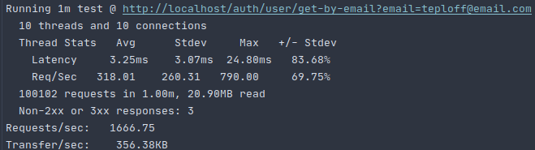

# Балансировка и отказоустойчивость

## Содержание
1. [ Задание ](#task)
   - [ Цель ](#task-goal)
   - [ Приобретенные навыки ](#task-skills)
   - [ Постановка задачи ](#task-statement)
2. [ Сведения ](#information)
   - [ Используемые инструменты ](#information-tools)
   - [ Характеристики железа ](#information-computer)
3. [ Ход работы ](#work)
   - [ Разработанная инфраструктура ](#work-infrastructure) 
   - [ Выполнение ](#work-execute)
        - [ Настройка асинхронной репликации ](#work-execute-async-replica)
            - [ Конфигурирование master-а ](#work-execute-async-replica-master-config)
            - [ Конфигурирование первого slave-а ](#work-execute-async-replica-first-slave-config)
            - [ Конфигурирование второго slave-а ](#work-execute-async-replica-second-slave-config)
            - [ Применение миграций ](#work-execute-async-replica-migration)
        - [ Запуск остальной части инфраструктуры ](#work-execute-launch-remaining-infrastructure)
        - [ Нагрузочное тестирование на чтение ](#work-execute-read-stress-testing)
            - [ Подготовка ](#work-execute-read-stress-testing-preparation)
            - [ Выполнение ](#work-execute-read-stress-testing-implementation)
            - [ Результаты ](#work-execute-read-results-stress-testing-implementation)
4. [ Итоги ](#results)


<a name="task"></a>
## Задание
Отказоустойчивость приложений.

<a name="task-goal"></a>
### Цель
Уменьшить число точек отказа в приложении путем добавления дополнительных экземпляров компонентов инфраструктуры и
добавления балансировки нагрузки между ними.

<a name="task-skills"></a>
### Приобретенные навыки
В результате выполненного задания необходимо приобрести следующие навыки:
- проектирование масштабируемых архитектур;
- администрирование nginx;
- администрирование HAProxy.

<a name="task-statement"></a>
### Постановка задачи
В процессе достижения цели необходимо:
- поднять несколько slave-узлов MySQL, один master-узел MySQL и реализовать соединение с ними через HAProxy.
- поднять несколько экземпляров приложения и обеспечить их балансировку через nginx.
- произвести нагрузочное тестирование, при этом:
   - в ходе эксперимента вывести из строя один из slave-узлов MySQL и убедиться, что система осталась работоспособной;
   - в ходе эксперимента вывести из строя один из экземпляров приложения и убедиться, что система также осталась     
   работоспособной.

<a name="information"></a>
## Сведения
<a name="information-tools"></a>
### Используемые инструменты
Для выполнения задания понадобятся следующие инструменты:
- [docker](https://docs.docker.com/get-docker/) (>= version 19.03.8) & [docker compose](https://docs.docker.com/compose/install/) (>= version 1.25.5);
- [curl](https://curl.haxx.se/download.html) (>= version 7.68.0);

<a name="information-computer"></a>
### Характеристики железа
Задание выполнялось на железе со следующими характеристиками:
- CPU - AMD Ryzen 9: 12 ядер 24 потока;
- RAM - 2xHyperX Fury Black: DDR4 DIMM 3000MHz 8GB;
- SSD - Intel® SSD 540s Series: 480GB, 2.5in SATA 6Gb/s, 16nm, TLC


<a name="work"></a>
## Ход работы

<a name="work-infrastructure"></a>
### Разработанная инфраструктура
Для выполнения задания будет достаточно следующего комплекта компонентов:
- одного экземпляра **revers-proxy** и **балансировщика nginx**;
- двух экземпляров микросервиса **auth**;
- одного экземпляра **Jaeger** для трассировки запросов;
- трех экземпляров **MySQL**, **один** из которых **master**, **остальные** - **slave**-ы.
- одного экземпляра **revers-proxy** и **балансировщика HAProxy**.

Для приближения к производственным условия, создадим три сети в докере:
- первая сеть - **Public network**, в которой будет находиться nginx. **Nginx** располагается на порту 80 будет доступен 
  конечному пользователю;
- вторая сеть - **Application network**, в которой будут находиться главные компоненты инфраструктуры: **Nginx**, 
  два экземпляра микросервиса **auth**, экземпляр **Jaeger** и сам **HAProxy**;
- третья сеть - **HAProxy network**, в которой находится экземпляр **HAProxy** и спрятанные за ним **mater** узел 
**MySQL** и два его **slave**-узла.

Разработанная инфраструктура имеет следующее представление: </br>
<p align="center">
    
</p>

<a name="work-execute"></a>
### Выполнение
Склонируем наш проект:
```shell
git clone https://github.com/teploff/otus-highload.git && cd otus-highload/balancing
```

Поднимаем инфраструктуру без экземпляров приложений, т.к. необходимо настроить репликацию:
```shell
make init
```

<a name="work-execute-async-replica"></a>
#### Настройка асинхронной репликации

<a name="work-execute-async-replica-master-config"></a>
#### Конфигурирование master-а
Заходим в master-container и открываем конфигурацию, которая располагается по пути **/etc/mysql/conf.d/mysql.cnf**, 
c помощью **nano**:
```shell script
docker exec -it auth-storage-master nano /etc/mysql/conf.d/mysql.cnf
```

Дописываем в конец секции **[mysqld]** следующие строки:
```textmate
[mysqld]
...
server-id = 1
default_authentication_plugin=mysql_native_password
log-bin = /var/log/mysql/mysql-bin.log
tmpdir = /tmp
binlog_format = STATEMENT
max_binlog_size = 500M
sync_binlog = 1
``` 

Сохраняем изменения сочетанием клавиш **CTRL+O**, закрываем конфиг **CTRL+X** и рестартуем docker-container:
```shell script
docker restart auth-storage-master
```

Переходим в оболочку mysql master-узла MySQL:
```shell script
docker exec -it auth-storage-master mysql -uroot -ppassword
```

Создаем пользователя для репликации:
```mysql based
create user 'replica'@'%' IDENTIFIED BY 'oTUSlave#2020';
```

Наделяем созданного пользователя полномочиями:
```mysql based
GRANT REPLICATION SLAVE ON *.* TO 'replica'@'%';
```

Вызываем команду *show master* для того, чтобы определить **MASTER_LOG_FILE** и **MASTER_LOG_POS**, которые понадобятся
нам в дальнейшем для настройки slave-ов:
```mysql based
show master status;
```

Результат может отличаться, но формат будет таким:<br />
<p align="center">
    
</p>

Теперь необходимо создать пользователя **haproxy_user**. Этот пользователь будет проверять жив ли master и slave 
экземпляры MySQL со стороны HAProxy. Достаточно будет пользователя добавить на стороне master-узла, т.к. затем эта 
информация среплицируется на slave-узлы. Важно, что пароль указывать не надо, иначе haproxy не сможет достучаться до
 экземпляров MySQL. Создадим пользователя:
```mysql
CREATE USER 'haproxy_user'@'%';
```

Выходим из оболочки MySQL командой:
```mysql based
exit
```

<a name="work-execute-async-replica-first-slave-config"></a>
#### Конфигурирование первого slave-а
Заходим в первый slave-container и открываем конфигурацию, которая располагается по пути 
**/etc/mysql/conf.d/mysql.cnf**, c помощью **nano**:
```shell script
docker exec -it auth-storage-slave-1 nano /etc/mysql/conf.d/mysql.cnf
```

Дописываем в конец секции **[mysqld]** следующие строки:
```textmate
[mysqld]
...
server-id = 2
default_authentication_plugin=mysql_native_password
log_bin = /var/log/mysql/mysql-bin.log
tmpdir = /tmp
binlog_format = STATEMENT
max_binlog_size = 500M
sync_binlog = 1
``` 

Сохраняем изменения сочетанием клавиш **CTRL+O**, закрываем конфиг **CTRL+X** и рестартуем docker-container::
```shell script
docker restart auth-storage-slave-1
```

Переходим в оболочку mysql контейнера:
```shell script
docker exec -it auth-storage-slave-1 mysql -uroot -ppassword
```

Вносим информацию о master-е:
```mysql based
CHANGE MASTER TO
    MASTER_HOST='auth-storage-master',
    MASTER_USER='replica',
    MASTER_PASSWORD='oTUSlave#2020',
    MASTER_LOG_FILE='mysql-bin.000001',
    MASTER_LOG_POS=665;
```

Запускаем slave:
```mysql based
start slave;
```

Выводим сводную информацию о состоянии slave-а:
```mysql based
show slave status\G
```

Если видим следующее, то все у нас в порядке:<br />
<p align="center">
    
</p>

Для того, чтобы выйти из контейнера, необходимо ввести:
```mysql based
exit
```

<a name="work-execute-async-replica-second-slave-config"></a>
#### Конфигурирование второго slave-а
Заходим во второй slave-container и открываем конфигурацию, которая располагается по пути 
**/etc/mysql/conf.d/mysql.cnf**, c помощью **nano**:
```shell script
docker exec -it auth-storage-slave-2 nano /etc/mysql/conf.d/mysql.cnf
```

Дописываем в конец секции **[mysqld]** следующие строки:
```textmate
[mysqld]
...
server-id = 3
default_authentication_plugin=mysql_native_password
log_bin = /var/log/mysql/mysql-bin.log
tmpdir = /tmp
binlog_format = STATEMENT
max_binlog_size = 500M
sync_binlog = 1
``` 

Сохраняем изменения сочетанием клавиш **CTRL+O**, закрываем конфиг **CTRL+X** и рестартуем docker-container::
```shell script
docker restart auth-storage-slave-2
```

Переходим в оболочку mysql контейнера:
```shell script
docker exec -it auth-storage-slave-2 mysql -uroot -ppassword
```

Вносим информацию о master-е:
```mysql based
CHANGE MASTER TO
    MASTER_HOST='auth-storage-master',
    MASTER_USER='replica',
    MASTER_PASSWORD='oTUSlave#2020',
    MASTER_LOG_FILE='mysql-bin.000001',
    MASTER_LOG_POS=665;
```

Запускаем slave:
```mysql based
start slave;
```

Выводим сводную информацию о состоянии slave-а:
```mysql based
show slave status\G
```

Если видим следующее, то все у нас в порядке:<br />
<p align="center">
    
</p>

Для того, чтобы выйти из контейнера, необходимо ввести:
```mysql based
exit
```

<a name="work-execute-async-replica-migration"></a>
#### Применение миграций
Еще одним хорошим способом проверки работы реплик является применение на master-узле MySQL миграций. Для того, чтобы 
накатить миграции выполним:
```shell script
make migrate
```

Теперь перейдем в контейнеры slave-ов и проверим, что в базе данных **auth** появились таблицы. Ниже представлен пример 
для первого slave-а.

Переходим в оболочку MySQL:
```shell script
docker exec -it auth-storage-slave-1 mysql -uroot -ppassword auth
```

И выводим список таблиц в распоряжении БД **auth**
```mysql based
show tables;
```

Если процесс миграции завершился успехом, должны увидеть следующее:<br />
<p align="center">
   
</p>

Для того, чтобы выйти из контейнера, необходимо ввести:
```mysql based
exit
```

<a name="work-execute-launch-remaining-infrastructure"></a>
#### Запуск остальной части инфраструктуры
Для того, чтобы поднять экземпляр **nginx** с двумя экземплярами микросервисов **auth**, необходимо ввести команду:
```shell script
make app
```

<a name="work-execute-read-stress-testing"></a>
#### Нагрузочное тестирование на чтение


<a name="work-execute-read-stress-testing-preparation"></a>
#### Подготовка
Перед тем, как осуществить нагрузку на чтение, необходимо зарегистрировать пользователя и получить его access_token, 
который понадобится в дальнейшем. Для этого **curl**-ом сделаем запросы следующего вида:
```shell script
curl -X POST -H "Content-Type: application/json" \
    -d '{"email": "teploff@email.com", "password": "1234567890", "name": "Alexander", "surname": "Teplov", "birthday": "1994-04-10T20:21:25+00:00", "sex": "male", "city": "Moscow", "interests": "Programming"}' \
    http://localhost/auth/sign-up
export ACCESS_TOKEN=$(curl -X POST -H "Content-Type: application/json" \
    -d '{"email": "teploff@email.com", "password": "1234567890"}' \
    http://localhost/auth/sign-in | jq -r '.access_token')
```

Проверим наличие access token-а:
```shell script
echo $ACCESS_TOKEN
```

<a name="work-execute-read-stress-testing-implementation"></a>
#### Выполнение
Запускаем нагрузочное тестирование командой:
```shell script
make wrk
```

и ждем окончания нагрузочного теста, который идет 60s.

<a name="work-execute-read-results-stress-testing-implementation"></a>
#### Результаты
В результате выполнения нагрузочного тестирования получаем следующую картину:<br />
<p align="center">
   
</p>

Из результатов видно, что ответов от сервера, статус которых отличается от 2xx или 3хх всего 3 на фоне 100102 успешно 
выполненных. Очевидно, что эти три запроса пришлись на "переходной" период.

Тем не менее можно говорить о том, что:
- оставшиеся-доступные экземпляры будь то slave-узел MySQL или экземпляр сервиса auth получили на себя всю нагрузку; 
- балансировка отработала успешно и инструменты в виде Nginx и HAProxy справились со своей задачей. 

<a name="results"></a>
## Итоги
В ходе выполнения задания:
- был описан процесс сборки и конфигурирования программного комплекса;
- была настроена async MySQL репликация между master и двумя slave-узлами;
- был верно сконфигурирован HAProxy, выступающий балансировщиком между доступными MySQL узлами;
- был верно сконфигурирован nginx, выступающий reverse-proxy и балансировщиком перед пользователем;
- был проведено нагрузочное тестирование, показавшее устойчивую инфраструктуру в случае сбоев; 
- были проанализированы результаты нагрузочного тестирования, доказывающие пригодность предложенной инфраструктуры.