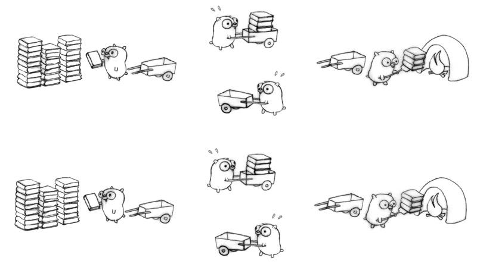
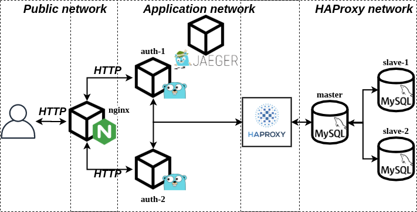
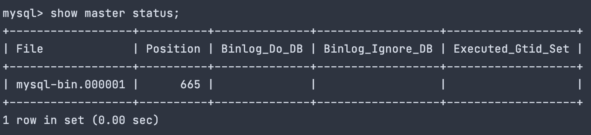
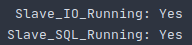
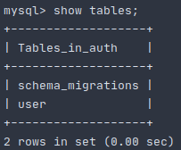

# Балансировка и отказоустойчивость

## Содержание
1. [ Задание ](#task)
   - [ Цель ](#task-goal)
   - [ Приобретенные навыки ](#task-skills)
   - [ Постановка задачи ](#task-statement)
2. [ Сведения ](#information)
   - [ Используемые инструменты ](#information-tools)
   - [ Характеристики железа ](#information-computer)
3. [ Ход работы ](#work)
   - [ Разработанная инфраструктура ](#work-infrastructure) 
   - [ Выполнение ](#work-execute)
        - [ Настройка асинхронной репликации ](#work-execute-async-replica)
            - [ Конфигурирование master-а ](#work-execute-async-replica-master-config)
            - [ Конфигурирование первого slave-а ](#work-execute-async-replica-first-slave-config)
            - [ Конфигурирование второго slave-а ](#work-execute-async-replica-second-slave-config)
            - [ Применение миграций ](#work-execute-async-replica-migration)
        - [ Запуск остальной части инфраструктуры ](#work-execute-launch-remaining-infrastructure)
        - [ Нагрузочное тестирование на чтение ](#work-execute-read-stress-testing)
            - [ Подготовка ](#work-execute-read-stress-testing-preparation)
            - [ Выполнение ](#work-execute-read-stress-testing-implementation)
            - [ Результаты ](#work-execute-read-results-stress-testing-implementation)
4. [ Итоги ](#results)



<a name="task"></a>
## Задание
Отказоустойчивость приложений.

<a name="task-goal"></a>
### Цель
Уменьшить число точек отказа в приложении путем добавления дополнительных экземпляров компонентов инфраструктуры и
добавления балансировки нагрузки между ними.

<a name="task-skills"></a>
### Приобретенные навыки
В результате выполненного задания необходимо приобрести следующие навыки:
- проектирование масштабируемых архитектур;
- администрирование nginx;
- администрирование HAProxy.

<a name="task-statement"></a>
### Постановка задачи
В процессе достижения цели необходимо:
- поднять несколько slave-узлов MySQL и реализовать соединение с ними через HAProxy с master узлом.
- поднять несколько экземпляров приложения и обеспечить их балансировку через nginx.
- произвести нагрузочное тестирование, при этом:
   - в ходе эксперимента вывести из строя один из slave-узлов MySQL и убедиться, что система осталась работоспособной;
   - в ходе эксперимента вывести из строя один из экземпляров приложения и убедиться, что система также осталась     
   работоспособной.

<a name="information"></a>
## Сведения
<a name="information-tools"></a>
### Используемые инструменты
Для выполнения задания понадобятся следующие инструменты:
- [docker](https://docs.docker.com/get-docker/) (>= version 19.03.8) & [docker compose](https://docs.docker.com/compose/install/) (>= version 1.25.5);

<a name="information-computer"></a>
### Характеристики железа
Задание выполнялось на железе со следующими характеристиками:
- CPU - AMD Ryzen 9: 12 ядер 24 потока;
- RAM - 2xHyperX Fury Black: DDR4 DIMM 3000MHz 8GB;
- SSD - Intel® SSD 540s Series: 480GB, 2.5in SATA 6Gb/s, 16nm, TLC


<a name="work"></a>
## Ход работы

<a name="work-infrastructure"></a>
### Разработанная инфраструктура
Для выполнения задания будет достаточно следующего комплекта компонентов:
- одного экземпляра **revers-proxy** и **балансировщика nginx**;
- двух экземпляров микросервиса **auth**;
- одного экземпляра **Jaeger** для трассировки запросов;
- трех экземпляров **MySQL**, **один** из которых **master**, **остальные** - **slave**-ы.
- одного экземпляра **revers-proxy HAProxy**.

Для приближения к производственным условия, создами три сети в докере:
- первая сеть - **Public network**, в которой будет находиться nginx. **Nginx** располагается на порту 80 будет доступен 
  конечному пользователю;
- вторая сеть - **Application network**, в которой будут находиться главные компоненты инфраструктуры: **Nginx**, 
  два экземпляра микросервиса **auth**, экземпляр **Jaeger**, **mater** узел **MySQL** и сам **HAProxy**;
- третья сеть - **HAProxy network**, в которой находится экземпляр **HAProxy** и спрятанные за ним два **slave**-узла.

Разработанная инфраструктура имеет следующее представление: </br>
<p align="center">
    
</p>

<a name="work-execute"></a>
### Выполнение
Склонируем наш проект:
```shell
git clone https://github.com/teploff/otus-highload.git && cd otus-highload/balancing
```

Поднимаем инфраструктуру без экземпляров приложений, т.к. необходимо настроить репликацию:
```shell
make init
```

<a name="work-execute-async-replica"></a>
#### Настройка асинхронной репликации

<a name="work-execute-async-replica-master-config"></a>
#### Конфигурирование master-а
Заходим в master-container и открываем конфигурацию, которая располагается по пути **/etc/mysql/conf.d/mysql.cnf**, 
c помощью **nano**:
```shell script
docker exec -it auth-storage-master nano /etc/mysql/conf.d/mysql.cnf
```

Дописываем в секцию **[mysqld]** следующие строки:
```textmate
[mysqld]
server-id = 1
default_authentication_plugin=mysql_native_password
log-bin = /var/log/mysql/mysql-bin.log
tmpdir = /tmp
binlog_format = STATEMENT
max_binlog_size = 500M
sync_binlog = 1
``` 

Сохраняем изменения сочетанием клавиш **CTRL+O**, закрываем конфиг **CTRL+X** и рестартуем docker-container:
```shell script
docker restart auth-storage-master
```

Переходим в оболочку mysql master-узла MySQL:
```shell script
docker exec -it auth-storage-master mysql -uroot -ppassword
```

Создаем пользователя для репликации:
```mysql based
create user 'replica'@'%' IDENTIFIED BY 'oTUSlave#2020';
```

Наделяем созданного пользователя полномочиями:
```mysql based
GRANT REPLICATION SLAVE ON *.* TO 'replica'@'%';
```

Вызываем команду *show master* для того, чтобы определить **MASTER_LOG_FILE** и **MASTER_LOG_POS**, которые понадобятся
нам в дальнейшем для настройки slave-ов:
```mysql based
show master status;
```

Результат может отличаться, но формат будет таким:<br />
<p align="center">
    
</p>

Выходим из оболочки MySQL командой:
```mysql based
exit
```

<a name="work-execute-async-replica-first-slave-config"></a>
#### Конфигурирование первого slave-а
Заходим в первый slave-container и открываем конфигурацию, которая располагается по пути 
**/etc/mysql/conf.d/mysql.cnf**, c помощью **nano**:
```shell script
docker exec -it auth-storage-slave-1 nano /etc/mysql/conf.d/mysql.cnf
```

Дописываем в секцию **[mysqld]** следующие строки:
```textmate
[mysqld]
server-id = 2
default_authentication_plugin=mysql_native_password
log_bin = /var/log/mysql/mysql-bin.log
tmpdir = /tmp
binlog_format = STATEMENT
max_binlog_size = 500M
sync_binlog = 1
``` 

Сохраняем изменения сочетанием клавиш **CTRL+O**, закрываем конфиг **CTRL+X** и рестартуем docker-container::
```shell script
docker restart auth-storage-slave-1
```

Переходим в оболочку mysql контейнера:
```shell script
docker exec -it auth-storage-slave-1 mysql -uroot -ppassword
```

Вносим информацию о master-е:
```mysql based
CHANGE MASTER TO
    MASTER_HOST='auth-storage-master',
    MASTER_USER='replica',
    MASTER_PASSWORD='oTUSlave#2020',
    MASTER_LOG_FILE='mysql-bin.000001',
    MASTER_LOG_POS=665;
```

Запускаем slave:
```mysql based
start slave;
```

Выводим сводную информацию о состоянии slave-а:
```mysql based
show slave status\G
```

Если видим следующее, то все у нас в порядке:<br />
<p align="center">
    
</p>

Для того, чтобы выйти из контейнера, необходимо ввести:
```mysql based
exit
```

<a name="work-execute-async-replica-second-slave-config"></a>
#### Конфигурирование второго slave-а
Заходим во второй slave-container и открываем конфигурацию, которая располагается по пути 
**/etc/mysql/conf.d/mysql.cnf**, c помощью **nano**:
```shell script
docker exec -it auth-storage-slave-2 nano /etc/mysql/conf.d/mysql.cnf
```

Дописываем в секцию **[mysqld]** следующие строки:
```textmate
[mysqld]
server-id = 3
default_authentication_plugin=mysql_native_password
log_bin = /var/log/mysql/mysql-bin.log
tmpdir = /tmp
binlog_format = STATEMENT
max_binlog_size = 500M
sync_binlog = 1
``` 

Сохраняем изменения сочетанием клавиш **CTRL+O**, закрываем конфиг **CTRL+X** и рестартуем docker-container::
```shell script
docker restart auth-storage-slave-2
```

Переходим в оболочку mysql контейнера:
```shell script
docker exec -it auth-storage-slave-2 mysql -uroot -ppassword
```

Вносим информацию о master-е:
```mysql based
CHANGE MASTER TO
    MASTER_HOST='auth-storage-master',
    MASTER_USER='replica',
    MASTER_PASSWORD='oTUSlave#2020',
    MASTER_LOG_FILE='mysql-bin.000001',
    MASTER_LOG_POS=665;
```

Запускаем slave:
```mysql based
start slave;
```

Выводим сводную информацию о состоянии slave-а:
```mysql based
show slave status\G
```

Если видим следующее, то все у нас в порядке:<br />
<p align="center">
    
</p>

Для того, чтобы выйти из контейнера, необходимо ввести:
```mysql based
exit
```

<a name="work-execute-async-replica-migration"></a>
#### Применение миграций
Еще одним хорошим способом проверки работы реплик является применение на master-узле MySQL миграций. Для того, чтобы 
накатить миграции выполним:
```shell script
make migrate
```

Теперь перейдем в контейнеры slave-ов и проверим, что в базе данных **auth** появились таблицы. Ниже представлен пример 
для первого slave-а.

Переходим в оболочку MySQL:
```shell script
docker exec -it auth-storage-slave-1 mysql -uroot -ppassword auth
```

И выводим список таблиц в распоряжении БД **auth**
```mysql based
show tables;
```

Если процесс миграции завершился успехом, должны увидеть следующее:<br />
<p align="center">
   
</p>

Для того, чтобы выйти из контейнера, необходимо ввести:
```mysql based
exit
```

<a name="work-execute-launch-remaining-infrastructure"></a>
#### Запуск остальной части инфраструктуры


<a name="work-execute-read-stress-testing"></a>
#### Нагрузочное тестирование на чтение


<a name="work-execute-read-stress-testing-preparation"></a>
#### Подготовка


<a name="work-execute-read-stress-testing-implementation"></a>
#### Выполнение


<a name="work-execute-read-results-stress-testing-implementation"></a>
#### Результаты


<a name="results"></a>
## Итоги
В ходе выполнения задания:
- был описан процесс сборки и конфигурирования программного комплекса;
- был декомпозирована монолитная инфраструктура на микросервисы;
- был существенно доработан сервис диалогов между пользователями (gRPC & WS);
- был внедрен механизм opentracing в виде jaeger-библиотеки;
- был реализован API Gateway сервис, являющий revers-proxy и одной точкой входа в систему;
- был внедрен OpenAPI на стороне микросервиса gateway;