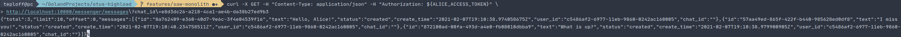

# Балансировка и отказоустойчивость

## Содержание
1. [ Задание ](#task)
   - [ Цель ](#task-goal)
   - [ Приобретенные навыки ](#task-skills)
   - [ Постановка задачи ](#task-statement)
2. [ Сведения ](#information)
   - [ Используемые инструменты ](#information-tools)
   - [ Характеристики железа ](#information-computer)
3. [ Ход работы ](#work)
   - [ Разработанная инфраструктура ](#work-infrastructure) 
   - [ Выполнение ](#work-execute)
        - [ Подготовка ](#work-execute-preparation)
        - [ Начало обмена сообщениями ](#work-execute-start-chatting)
            - [ Терминальное окно Боба ](#work-execute-start-chatting-bob-term)
            - [ Терминальное окно Алисы ](#work-execute-start-chatting-alice-term)
            - [ Отправка сообщений ](#work-execute-start-chatting-send-msg)
        - [ Окончание переписки ](#work-execute-stop-chatting)
        - [ Историческая выгрузка сообщений ](#work-execute-history-dump)
    - [ Технические моменты ](#work-technical-moments)
      - [ Модернизация микросервиса диалогов ](#work-technical-moments-messenger)
      - [ OpenAPI.Swagger ](#work-technical-moments-swagger)
      - [ Opentracing. Jaeger ](#work-technical-moments-jaeger)
4. [ Итоги ](#results)


<a name="task"></a>
## Задание
Отказоустойчивость приложений.

<a name="task-goal"></a>
### Цель
Уменьшить число точек отказа в приложении путем добавления дополнительных экземпляров компонентов инфраструктуры и
добавления балансировки нагрузки между ними.

<a name="task-skills"></a>
### Приобретенные навыки
В результате выполненного задания необходимо приобрести следующие навыки:
- проектирование масштабируемых архитектур;
- администрирование nginx;
- администрирование HAProxy.

<a name="task-statement"></a>
### Постановка задачи
В процессе достижения цели необходимо:
- поднять несколько slave-узлов MySQL и реализовать соединение с ними через HAProxy с master узлом.
- поднять несколько экземпляров приложения и обеспечить их балансировку через nginx.
- произвести нагрузочное тестирование, при этом:
   - в ходе эксперимента вывести из строя один из slave-узлов MySQL и убедиться, что система осталась работоспособной;
   - в ходе эксперимента вывести из строя один из экземпляров приложения и убедиться, что система также осталась     
   работоспособной.

<a name="information"></a>
## Сведения
<a name="information-tools"></a>
### Используемые инструменты
Для выполнения задания понадобятся следующие инструменты:
- [docker](https://docs.docker.com/get-docker/) (>= version 19.03.8) & [docker compose](https://docs.docker.com/compose/install/) (>= version 1.25.5);

<a name="information-computer"></a>
### Характеристики железа
Задание выполнялось на железе со следующими характеристиками:
- CPU - AMD Ryzen 9: 12 ядер 24 потока;
- RAM - 2xHyperX Fury Black: DDR4 DIMM 3000MHz 8GB;
- SSD - Intel® SSD 540s Series: 480GB, 2.5in SATA 6Gb/s, 16nm, TLC


<a name="work"></a>
## Ход работы

<a name="work-infrastructure"></a>
### Разработанная инфраструктура
Для выполнения задания будет достаточно следующего комплекта компонентов:
- одного экземпляра **revers-proxy** и **балансировщика nginx**;
- двух экземпляров микросервиса **auth**;
- одного экземпляра **Jaeger** для трассировки запросов;
- трех экземпляров **MySQL**, **один** из которых **master**, **остальные** - **slave**-ы.
- одного экземпляра **revers-proxy HAProxy**.

Для приближения к производственным условия, создами три сети в докере:
- первая сеть - **Public network**, в которой будет находиться nginx. **Nginx** располагается на порту 80 будет доступен 
  конечному пользователю;
- вторая сеть - **Application network**, в которой будут находиться главные компоненты инфраструктуры: **Nginx**, 
  два экземпляра микросервиса **auth**, экземпляр **Jaeger**, **mater** узел MySQL и сам **HAProxy**;
- третья сеть - **HAProxy network**, в которой находится экземпляр **HAProxy** и спрятанные за ним два **slave**-узла.

Разработанная инфраструктура имеет следующее представление: </br>
<p align="center">
    
</p>

<a name="work-execute"></a>
### Выполнение
Склонируем наш проект:
```shell
git clone https://github.com/teploff/otus-highload.git && cd otus-highload
```

Поднимаем инфраструктуру и применяем миграции:
```shell
make infrastructure && make migrate && make service
```

<a name="work-execute-preparation"></a>
#### Подготовка
Для демонстрации работы микросервисного представления системы, на примере осуществления диалогов между пользователями,
создадим двух пользователей в системе: **Боба** и **Алису**.
```shell script
curl -X POST -H "Content-Type: application/json" \
    -d '{"email": "bob@email.com", "password": "1234567890", "name": "Bob", "surname": "Tallor", "birthday": "1994-04-10T20:21:25+00:00", "sex": "male", "city": "New Yourk", "interests": "programming"}' \
    http://localhost:10000/auth/sign-up
curl -X POST -H "Content-Type: application/json" \
    -d '{"email": "alice@email.com", "password": "1234567890", "name": "Alice", "surname": "Swift", "birthday": "1995-10-10T20:21:25+00:00", "sex": "female", "city": "California", "interests": "running"}' \
    http://localhost:10000/auth/sign-up
```

<a name="work-execute-start-chatting"></a>
#### Начало обмена сообщениями
Для того, чтобы начать обмениваться сообщениями, необходимо открыть два терминальных окна. Одно будет принадлежать Бобу,
другое Алисе.

<a name="work-execute-start-chatting-bob-term"></a>
##### Терминальное окно Боба
В первом терминальном окне, предназначенном для Боба, получим access token командой:
```shell script
export BOB_ACCESS_TOKEN=$(curl -X POST -H "Content-Type: application/json" \
    -d '{"email": "bob@email.com", "password": "1234567890"}' \
    http://localhost:10000/auth/sign-in | jq -r '.access_token')
``` 

Проверим наличие access token-а:
```shell script
echo $BOB_ACCESS_TOKEN
```

Для того, чтобы от лица Боба создать чат с Алисой, необходимо получить ее ID, так как он понадобится для указания 
собеседника. Воспользуемся endpoint-ом на получения ID пользователя, зная его email:
```shell script
export ALICE_ID=$(curl -X GET -H "Content-Type: application/json" -H "Authorization: ${BOB_ACCESS_TOKEN}" \
    http://localhost:10000/auth/user/get-by-email?email=alice@email.com | jq -r '.user_id')
```

Проверим, что запрос успешно выполнился, применив команду:
```shell script
echo $ALICE_ID
```

Создадим чат от лица Боба с Алисой:
```shell script
export CHAT_ID=$(curl -X POST -H "Content-Type: application/json" -H "Authorization: ${BOB_ACCESS_TOKEN}" \
    -d '{"companion_id": "'"$ALICE_ID"'"}' \
    http://localhost:10000/messenger/create-chat | jq -r '.chat_id')
```

Проверим, что в переменной окружения находится UUID созданного чата:
```shell script
echo $CHAT_ID
```

<a name="work-execute-start-chatting-alice-term"></a>
##### Терминальное окно Алисы
Во втором терминальном окне, предназначенном для Алисы, получим access token командой:
```shell script
export ALICE_ACCESS_TOKEN=$(curl -X POST -H "Content-Type: application/json" \
    -d '{"email": "alice@email.com", "password": "1234567890"}' \
    http://localhost:10000/auth/sign-in | jq -r '.access_token')
``` 

Для установления websocket-ного соединения со стороны Алисы к серверу необходимо ввести команду:
```shell script
websocat ws://localhost:10000/messenger/ws\?token=${ALICE_ACCESS_TOKEN}
```

<a name="work-execute-start-chatting-send-msg"></a>
##### Отправка сообщений
Теперь, когда Алиса установила websocket-ное соединение с сервером, она готова принимать сообщения от Боба.

Для этого необходимо вернуться в первое терминальное окно, принадлежащее Бобу. Установить также websocket-ное содениение
командой:
```shell script
websocat ws://localhost:10000/messenger/ws\?token=${BOB_ACCESS_TOKEN}
```
И зная ChatID, например, если он имеет значение **e8d3dc26-a218-4ca1-ae4b-da38b27ed9b3**, отправить сообщения следующего
вида:
```shell script
{"topic":"messenger", "action": "send-message", "payload":"{\"chat_id\":\"e8d3dc26-a218-4ca1-ae4b-da38b27ed9b3\", \"messages\":[{\"text\": \"Hello, Alice!\", \"status\": \"created\"}]}"}
{"topic":"messenger", "action": "send-message", "payload":"{\"chat_id\":\"e8d3dc26-a218-4ca1-ae4b-da38b27ed9b3\", \"messages\":[{\"text\": \"What is up?\", \"status\": \"created\"}]}"}
{"topic":"messenger", "action": "send-message", "payload":"{\"chat_id\":\"e8d3dc26-a218-4ca1-ae4b-da38b27ed9b3\", \"messages\":[{\"text\": \"I miss you!\", \"status\": \"created\"}]}"}
```

Теперь перейдем в терминал Алисы и удостоверимся, что получили все три сообщения от Боба. В терминале должны увидеть 
следующее:</br>
<p align="center">
  
</p>

<a name="work-execute-stop-chatting"></a>
#### Окончание переписки
Для того, чтобы закрыть websocket-ные соединения от каждого из пользователей с сервером, необходимо в каждом 
терминальном окне ввести сочетание клавиш **Ctrl+C**.

<a name="work-execute-history-dump"></a>
#### Историческая выгрузка сообщений
Теперь проверим gRPC запросы от **gateway**-я к микросервису **messenger** для выгрузки сообщений по конкретному чату.

Для этого находясь в терминальном окне Алисы и зная id чата (в данном контексте он имеет значение 
**e8d3dc26-a218-4ca1-ae4b-da38b27ed9b3**) получим сообщения, которые ей отослал Боб:
```shell script
curl -X GET -H "Content-Type: application/json" -H "Authorization: ${ALICE_ACCESS_TOKEN}" \
http://localhost:10000/messenger/messages?chat_id=e8d3dc26-a218-4ca1-ae4b-da38b27ed9b3
```

Если все прошло успешно, должны увидеть нечто похожее: </br>
<p align="center">
    
</p>
    
<a name="work-technical-moments"></a>
### Технические моменты
В ходе выполнения задания так же необходимо упомянуть, что были разработаны или доработаны следующие технические 
решения. 
<a name="work-technical-moments-messenger"></a>
#### Модернизация микросервиса диалогов
В процессе декомпозиции монолита на микросервисы, микросервис **messenger** был существенно доработан, а именно:
- создание чата и выгрузка сообщений осуществляется с помощью gRPC;
- отправка и прием сообщения осуществляется по Websocket-у;

Т.е. простого решения в виде чистого REST-а уже нет. Все по серьезному:)
<a name="work-technical-moments-swagger"></a>
#### OpenAPI. Swagger
Появилась спецификация в виде Swagger endpoint'а на стороне gateway-я, в которой можно посмотреть и ознакомиться со
всеми доступными endpoint-ами извне конечному интегратору, будь то Web или Mobile - решения.

Endpoint Swagger-а располагается по адресу: http://localhost:10000/swagger/index.html.

Пример спецификации swagger, доступного по endpoint-у:</br>
<p align="center">
 
</p>

<a name="work-technical-moments-jaeger"></a>
#### Opentracing. Jaeger
Появилась возможность сквозного логирования и трассировки запросов в виде Jaeger-решения. В нем можно конкретно
отследить затраченное время на тот или иной скачок к тому или иному микросервису.

Jaeger располагается по адресу: http://localhost:16686.

Пример трассировки запроса на регистрацию пользователя в системе:</br>
<p align="center">
 
</p>

<a name="results"></a>
## Итоги
В ходе выполнения задания:
- был описан процесс сборки и конфигурирования программного комплекса;
- был декомпозирована монолитная инфраструктура на микросервисы;
- был существенно доработан сервис диалогов между пользователями (gRPC & WS);
- был внедрен механизм opentracing в виде jaeger-библиотеки;
- был реализован API Gateway сервис, являющий revers-proxy и одной точкой входа в систему;
- был внедрен OpenAPI на стороне микросервиса gateway;