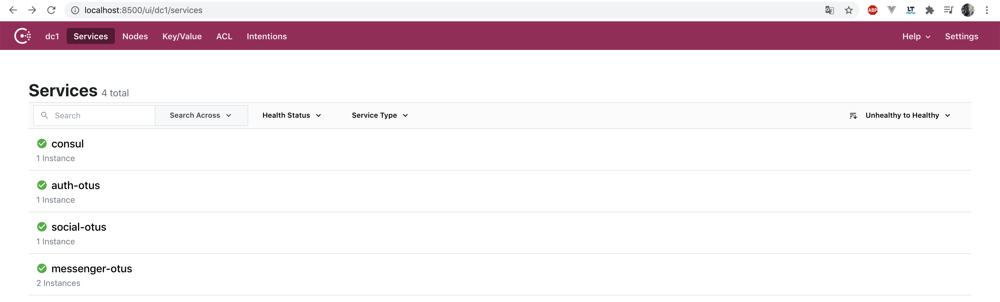
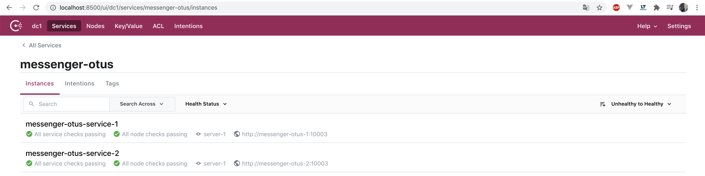

# Внедрение docker и consul

## Содержание
1. [ Задание ](#task)
   - [ Цель ](#task-goal)
   - [ Приобретенные навыки ](#task-skills)
   - [ Постановка задачи ](#task-statement)
2. [ Сведения ](#information)
   - [ Используемые инструменты ](#information-tools)
   - [ Характеристики железа ](#information-computer)
3. [ Ход работы ](#work)
   - [ Контейнеризация с помощью docker ](#work-docker-containerization) 
   - [ Механизм auto-discovery и consul ](#work-auto-discovery)
   - [ Сборка и запуск инфраструктуры ](#work-build-infrastructure)
4. [ Итоги ](#results)


<a name="task"></a>
## Задание
Внедрение docker и consul.

<a name="task-goal"></a>
### Цель
Контейнеризовать микросервисы с помощью docker и организовать их auto-discovery и балансировку с помощью consul.

<a name="task-skills"></a>
### Приобретенные навыки
В результате выполненного задания необходимо приобрести следующие навыки:
- проектирование масштабируемых архитектур;
- использование docker;
- использование consul;
- реализация механизма auto discovery;
- реализация механизма балансировки нагрузки с помощью consul;

<a name="task-statement"></a>
### Постановка задачи
В процессе достижения цели необходимо:
- контейнеризировать все микросервисы и использующие инфраструктурные элементы (MySQL, Redis, Jaeger и т.д.) в docker-е;
- интегрировать consul в существующую инфраструктуру;
- реализовать механизм auto discovery на стороне всех микросервсиов;
- реализовать механизм балансировки нагрузки микросервиса диалогов (messenger);

<a name="information"></a>
## Сведения
<a name="information-tools"></a>
### Используемые инструменты
Для выполнения задания понадобятся следующие инструменты:
- [docker](https://docs.docker.com/get-docker/) (>= version 19.03.8) & [docker compose](https://docs.docker.com/compose/install/) (>= version 1.25.5);

<a name="information-computer"></a>
### Характеристики железа
Задание выполнялось на железе со следующими характеристиками:
- CPU - AMD Ryzen 9: 12 ядер 24 потока;
- RAM - 2xHyperX Fury Black: DDR4 DIMM 3000MHz 8GB;
- SSD - Intel® SSD 540s Series: 480GB, 2.5in SATA 6Gb/s, 16nm, TLC


<a name="work"></a>
## Ход работы

<a name="work-docker-containerization"></a>
### Контейнеризация с помощью docker
Были контейнеризированы в виде отдельно-независимых docker-контейнеров все микросервисы системы, а именно:
- gateway;
- auth;
- messenger;
- social.

Сборка docker-image'ов представляла собой multi-stage-сборку. Т.е. изначально собирался binary-файл и уже на втором
этапе прокидывался в пустой image, в котором отсутствует лишнее. Подробнее о multi-stage сборке, можно узнать [здесь](https://docs.docker.com/develop/develop-images/multistage-build/).
  
Сами docker-файлы микросервисов:
- [Dockerfile для gateway](https://github.com/teploff/otus-highload/blob/features/configuration-system/backend/gateway/Dockerfile);
- [Dockerfile для auth](https://github.com/teploff/otus-highload/blob/features/configuration-system/backend/auth/Dockerfile);
- [Dockerfile для messenger](https://github.com/teploff/otus-highload/tree/features/configuration-system/backend/messenger);
- [Dockerfile для social](https://github.com/teploff/otus-highload/blob/features/configuration-system/backend/social/Dockerfile).

Кроме того, были докеризированы и инфраструктуры не компоненты системы, а именно:
- MySQL БД для микросервисов auth и social;
- Redis для кеширования ленты новостей на стороне микросерврисы social;
- Шина данных Nats-Streaming;
- Кластер Clickhouse, состоящий из одного cluster узла и двух шардов;
- Jaeger для трассировки запросов между микросервисами;
- и собственно сам Consul.

Вся представленная выше инфраструктура собрана в виде docker-compose файла, который располагается [здесь](https://github.com/teploff/otus-highload/blob/features/configuration-system/auto-discovery/docker-compose.yml).

<a name="work-auto-discovery"></a>
### Механизм auto-discovery и механизм балансировки через consul
Механизм auto-discovery представлен достаточно просто. Для этого необходимо, пользуясь API Consul:
- зарегистрировать сервис, при его запуске;
- выполнить обратную операцию регистрации, называемую *deregister* в API Consul'а, при завершения работы сервиса;
- реализовать health-check endpoint для Consul'а, с помощью которого Consul будет определять "живучесть" микросервиса.

GO-имплементация вышесказанного на примере микросервиса **auth** представлена [здесь](https://github.com/teploff/otus-highload/blob/features/configuration-system/backend/auth/internal/infrastructure/consul/consul.go).

Механизм балансировки через consul осуществляется так же через его API.
Для этого необходимо, зная интересующее наименование микросервиса, в данном случае это *messenger-service*, периодически (в отдельной 
горутине) получать адреса активных экземпляров через consul API;

GO-имплементация вышесказанного на примере микросервиса **gateway**, который балансирует нагрузку, представлена [здесь](https://github.com/teploff/otus-highload/blob/features/configuration-system/backend/gateway/internal/infrastructure/consul/consul.go).


Зарегистрированные микросервисы у UI consul'а принимают следующее представление:<br />
<p align="center">
   
</p>


Так же в нем отчетливо можно увидеть несколько зарегистрированных экземпляров одного и того же микросервиса по одному 
наименованию:<br />
<p align="center">
   
</p>


<a name="work-build-infrastructure"></a>
## Сборка и запуск инфраструктуры
Клонируем наш проект:
```shell
git clone https://github.com/teploff/otus-highload.git
```

Переходим в ветку **configuration-system**:
```shell
git checkout configuration-system && && cd otus-highload/auto-discovery
```

Поднимаем инфраструктуру:
```shell
make init && make migrate && make app
```

<a name="results"></a>
## Итоги
В ходе выполнения задания:
- был описан процесс сборки и конфигурирования программного комплекса;
- были контейнеризированы все микросервисы проекта и использующие инфраструктурные компоненты (БД, кеш, брокер сообщений
  и т.д.)  
- был реализован механизм auto-discovery всех микросервисов проекта
- был реализован механизм балансировки нагрузки между несколькими экземплярами микросервисов диалогов (messenger) при
  помощи consul.