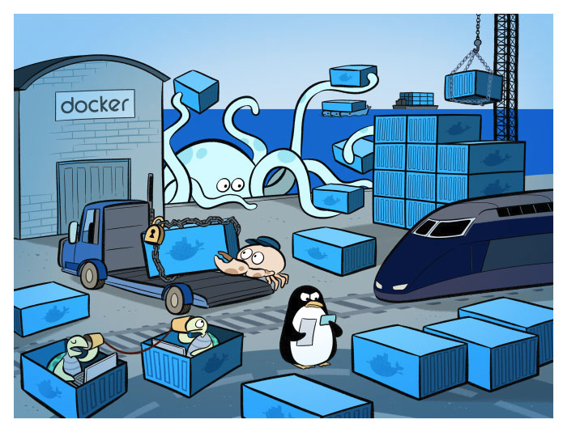
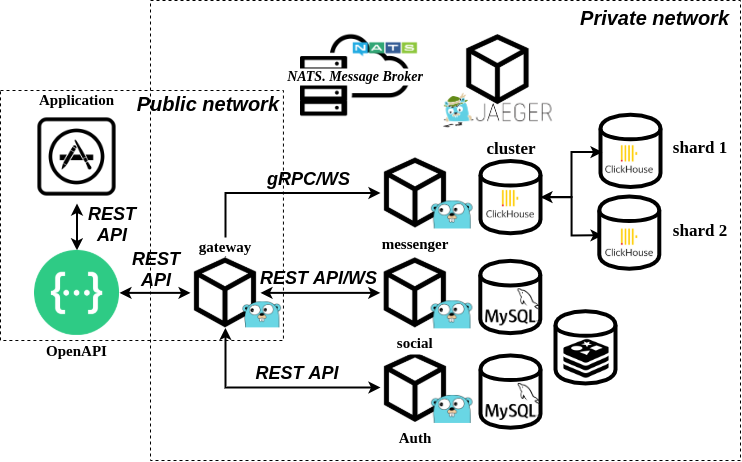

# Microservices

## Содержание
1. [ Задание ](#task)
    - [ Цель ](#task-goal)
    - [ Приобретенные навыки ](#task-skills)
    - [ Постановка задачи ](#task-statement)
2. [ Сведения ](#information)
    - [ Используемые инструменты ](#information-tools)
    - [ Характеристики железа ](#information-computer)
3. [ Ход работы ](#work)
    - [ Предложенный вариант решения ](#work-solution)
        - [ Преимущества и смысловая нагрузка микросервиса Gateway ](#work-solution-gateway)
        - [ Разработанная микросервисная инфраструктура ](#work-solution-microservice-infrastructure) 
    - [ Выполнение ](#work-execute)
        - [ Подготовка ](#work-execute-preparation)
    - [ Технические моменты ](#work-technical-moments)
      - [ Серверная часть ](#work-technical-moments-server)
      - [ Клиентская часть ](#work-technical-moments-client)
4. [ Итоги ](#results)



<a name="task"></a>
## Задание
Декомпозиция монолитной инфраструктуры на микросервисы.

<a name="task-goal"></a>
### Цель
Декомпозировать бизнес-домен монолитной инфраструктуры на отдельные микросервисы.

<a name="task-skills"></a>
### Приобретенные навыки
В результате выполненного задания необходимо приобрести следующие навыки:
- декомпозиции предметной области;
- разделение монолитного приложения;
- работа с HTTP;
- работа с REST API и gRPC;
- проектирование масштабируемых архитектур.

<a name="task-statement"></a>
### Постановка задачи
Декомпозировать имеющую монолитную инфраструктуру на микросервисы, каждый из которых выполняет строго определенную 
бизнес-доменную задачу. Для этого необходимо:
- вынести систему диалогов в отдельный микросервис;
- вынести систему регистрации/авторизации/аутентификации в отдельный микросервис;
- вынести систему бизнес модели социальной сети (друзья, новости и тд) в отдельный микросервис;
- осуществить взаимодействие между микросервисами по REST API и gRPC;
- организовать сквозное логирование;
- предусмотреть то, что не все клиенты обновляют приложение быстро и кто-то может ходить через старое API.

<a name="information"></a>
## Сведения
<a name="information-tools"></a>
### Используемые инструменты
Для выполнения задания понадобятся следующие инструменты:
- [docker](https://docs.docker.com/get-docker/) (>= version 19.03.8) & [docker compose](https://docs.docker.com/compose/install/) (>= version 1.25.5);
- [curl](https://curl.haxx.se/download.html) (>= version 7.68.0);
- [websocat](https://github.com/vi/websocat/releases) (>= version 1.6.0);
- [jq](https://stedolan.github.io/jq/download/) (>= version 1.5).

<a name="information-computer"></a>
### Характеристики железа
Задание выполнялось на железе со следующими характеристиками:
- CPU - AMD Ryzen 9: 12 ядер 24 потока;
- RAM - 2xHyperX Fury Black: DDR4 DIMM 3000MHz 8GB;
- SSD - Intel® SSD 540s Series: 480GB, 2.5in SATA 6Gb/s, 16nm, TLC


<a name="work"></a>
## Ход работы

<a name="work-solution"></a>
### Предложенный вариант решения
При решении таких задача, как:
- декомпозиция предметной области, т.е. "распил" монолита на микросервисы;
- сохранение возможности клиентам, которые не сразу обновляют приложения, ходить через старый API;
- возможность гибкого выбора тех типов микросервисных взаимодействий, которые покажутся целесообразными;

возникает соблазн создать такую инфраструктуру, которая решит сразу все эти проблемы. Предлагается внедрение
микросервиса revers-proxy gateway или иначе называемом шлюзом или единой точкой входа в систему. 

В качестве инструмента сквозного логирования, безусловно, будет использоваться [opentracing](https://opentracing.io/), а
точнее библиотека [Jaeger](https://www.jaegertracing.io/).

<a name="work-solution-gateway"></a>
#### Преимущества и смысловая нагрузка микросервиса Gateway 
Чем этот шаблон построения микросервсиной архитектуры хорош?

- безопасность. Одна точка входа. Пользователь не имеет на прямую доступ к сервисам, находящихся в приватной сети;
- балансировка нагрузки;
- возможность кастомизации роутинга запросов.

О кастомизации поподробнее.

Мы хотим, чтоб пользователь, не меняя своего протокола, ходил по тем же endpoint'ам, что и раньше и не задумывался, что
там внутри gRPC, REST API или graphQL. Для этого мы пользователю предоставляем одну точку входа и инкапсулируем логику
работы нашей инфраструктуры. 

Тем самым:
1. появляется возможность интегрировать gRPC межмикросервисное взаимодействие.
2. оставить протокол с пользователем тем же;

<a name="work-solution-microservice-infrastructure"></a>
#### Разработанная микросервисная инфраструктура
Монолитная инфраструктура была декомпозирована на четыре микросервиса:
- микросервис **gateway**, служащий reverse-proxy и одной точкой входа в систему;
- микросервис **auth**, предназначенный для регистрации/авторизации/аутентификации пользователей в системе;
- микросервис **social**, содержащий бизнес логику социальной сети (CRUD друзья, подписчики, лента новостей);
- микросервис **messenger**, являющийся системой диалогов.

В инфраструктуре также присутствуют:
- два экземпляра MySQL для персистентного хранилища данных микросервисов **auth** и **social**;
- три экземпляра Clickhouse (одна cluster node'а и две node'ы для шардирования) для персистентности микросервиса 
**messenger**;
- экземпляр **Redis**, для кеширования новостной ленты;
- экземпляр шины данных **NATS & NATS-Streaming**;
- экземпляр **Jaeger** для сквозного логирования и трассировки запросов к системе.

Разработанная микросервисная инфраструктура имеет следующее представление: </br>
<p align="center">
    
</p>

<a name="work-execute"></a>
### Выполнение
Склонируем наш проект:
```shell
git clone https://github.com/teploff/otus-highload.git && cd otus-highload
```

Поднимаем инфраструктуру и применяем миграции:
```shell
make infrastructure && make migrate && make service
```

<a name="work-execute-preparation"></a>
#### Подготовка
Для демонстрации работы микросервисного представления системы, на примере осуществления диалогов между пользователями,
создадим трех пользователей в системе:
 - Боб
 - Алиса
 - Генри
```shell script
curl -X POST -H "Content-Type: application/json" \
    -d '{"email": "bob@email.com", "password": "1234567890", "name": "Bob", "surname": "Tallor", "birthday": "1994-04-10T20:21:25+00:00", "sex": "male", "city": "New Yourk", "interests": "programming"}' \
    http://localhost:10000/auth/sign-up
curl -X POST -H "Content-Type: application/json" \
    -d '{"email": "alice@email.com", "password": "1234567890", "name": "Alice", "surname": "Swift", "birthday": "1995-10-10T20:21:25+00:00", "sex": "female", "city": "California", "interests": "running"}' \
    http://localhost:10000/auth/sign-up
curl -X POST -H "Content-Type: application/json" \
    -d '{"email": "henry@email.com", "password": "1234567890", "name": "Henry", "surname": "Cavill", "birthday": "1993-08-19T20:21:25+00:00", "sex": "male", "city": "Washington", "interests": "sport"}' \
    http://localhost:10000/auth/sign-up
```

Получим access token'ы от системы для наших пользователей и запишем их в переменные окружения:
```shell script
export BOB_ACCESS_TOKEN=$(curl -X POST -H "Content-Type: application/json" \
    -d '{"email": "bob@email.com", "password": "1234567890"}' \
    http://localhost:10000/auth/sign-in | jq -r '.access_token')
export ALICE_ACCESS_TOKEN=$(curl -X POST -H "Content-Type: application/json" \
    -d '{"email": "alice@email.com", "password": "1234567890"}' \
    http://localhost:10000/auth/sign-in | jq -r '.access_token')
export HENRY_ACCESS_TOKEN=$(curl -X POST -H "Content-Type: application/json" \
    -d '{"email": "henry@email.com", "password": "1234567890"}' \
    http://localhost:10000/auth/sign-in | jq -r '.access_token')
```

Проверим наличие access token-ов:
```shell script
echo $BOB_ACCESS_TOKEN
echo $ALICE_ACCESS_TOKEN
echo $HENRY_ACCESS_TOKEN
```

Теперь давайте немного початимся :). Для того, чтобы от лица Боба создать чат с Алисой, необходимо получить ее ID, так
как он понадобится для указания собеседника. Воспользуемся URL-ом на получения ID пользователя, зная его email:
```shell script
export ALICE_ID=$(curl -X GET -H "Content-Type: application/json" -H "Authorization: ${BOB_ACCESS_TOKEN}" \
    http://localhost:10000/auth/user/get-by-email?email=alice@email.com | jq -r '.user_id')
```

Проверим, что запрос успешно выполнился, применив команду:
```shell script
echo $ALICE_ID
```

Создадим чат от лица Боба с Алисой:
```shell script
export CHAT_ID=$(curl -X POST -H "Content-Type: application/json" -H "Authorization: ${BOB_ACCESS_TOKEN}" \
    -d '{"companion_id": "'"$ALICE_ID"'"}' \
    http://localhost:10000/messenger/create-chat | jq -r '.chat_id')
```

Проверим, что в переменной окружения находится UUID созданного чата:
```shell script
echo $CHAT_ID
```

Теперь необходимо початиться с Алисой. Для этого установим два websocket'ых соединения со стороны Боба и Алисы 
соответственно. Для этого в двух терминальных окнах введем следующие команды:

В первом терминальном окне, предназначенном для Боба, введем:                              
```shell script
export BOB_ACCESS_TOKEN=$(curl -X POST -H "Content-Type: application/json" \
    -d '{"email": "bob@email.com", "password": "1234567890"}' \
    http://localhost:10000/auth/sign-in | jq -r '.access_token')
websocat ws://localhost:10000/messenger/ws\?token=${BOB_ACCESS_TOKEN}
```

Во втором терминальном окне, предназначенном для Алисы, введем:
```shell script
export ALICE_ACCESS_TOKEN=$(curl -X POST -H "Content-Type: application/json" \
    -d '{"email": "alice@email.com", "password": "1234567890"}' \
    http://localhost:10000/auth/sign-in | jq -r '.access_token')
websocat ws://localhost:10000/messenger/ws\?token=${ALICE_ACCESS_TOKEN}
```

Отправим со стороны Боба Алисе несколько сообщений. Находясь в терминальном окне, в котором открыто websocket-соединение
Боба с сервером, отправим сообщения:
```shell script
{"topic":"messenger", "action": "send-message", "payload":"{\"chat_id\":\"${CHAT_ID}\", \"messages\":[{\"text\": \"Hello, Alice!\", \"status\": \"created\"}]}"}
{"topic":"messenger", "action": "send-message", "payload":"{\"chat_id\":\"${CHAT_ID}\", \"messages\":[{\"text\": \"What is up?\", \"status\": \"created\"}]}"}
{"topic":"messenger", "action": "send-message", "payload":"{\"chat_id\":\"${CHAT_ID}\", \"messages\":[{\"text\": \"I miss you!\", \"status\": \"created\"}]}"}
```

Теперь перейдем в терминал Алисы и удостоверимся, что получили все три сообщения от Боба. В терминале должны увидеть 
следующее:</br>
<p align="center">
  
</p>

Получим со стороны Алисы, зная CHAT_ID, сообщения, которые ей отослал Боб:
```shell script
curl -X GET -H "Content-Type: application/json" -H "Authorization: ${ALICE_ACCESS_TOKEN}" \
http://localhost:10000/messenger/messages?chat_id=$CHAT_ID
```

Если все прошло успешно, должны увидеть нечто похожее: </br>
<p align="center">
    
</p>
    
