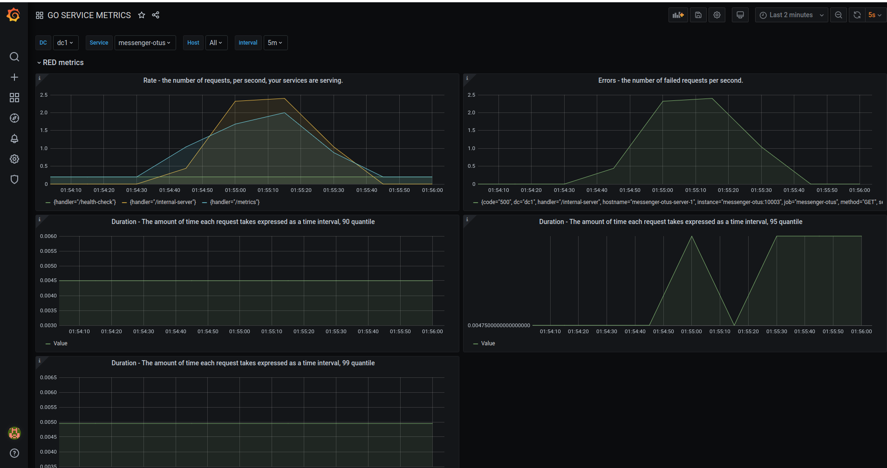

# Мониторинг

## Содержание
1. [ Задание ](#task)
   - [ Цель ](#task-goal)
   - [ Приобретенные навыки ](#task-skills)
   - [ Постановка задачи ](#task-statement)
2. [ Сведения ](#information)
   - [ Используемые инструменты ](#information-tools)
   - [ Характеристики железа ](#information-computer)
3. [ Ход работы ](#work)
   - [ Сборка и запуск инфраструктуры ](#work-build-infrastructure)
   - [ Мониторинг с помощью Zabbix ](#work-zabbix)
        - [ Подготовка ](#work-zabbix-preparation)
        - [ Просмотр метрик ](#work-zabbix-metrics)
   - [ Мониторинг с помощью Prometheus ](#work-prometheus)
        - [ Подготовка ](#work-prometheus-preparation)
        - [ Визуализация метрик с помощью Grafana ](#work-prometheus-grafana-visualize)
4. [ Итоги ](#results)


<a name="task"></a>
## Задание
Мониторинг.

<a name="task-goal"></a>
### Цель
Организовать мониторинг сервиса диалогов.

<a name="task-skills"></a>
### Приобретенные навыки
В результате выполненного задания необходимо приобрести следующие навыки:
- эксплуатация prometheus;
- эксплуатация grafana;
- эксплуатация zabbix.

<a name="task-statement"></a>
### Постановка задачи
В процессе достижения цели необходимо:
- развернуть zabbix, prometheus и grafana;
- начать писать в prometheus бизнес-метрики сервиса чатов по принципу RED;
- начать писать в zabbix технические метрики сервера с сервисом чатов;
- организовать дашборд в grafana.

<a name="information"></a>
## Сведения
<a name="information-tools"></a>
### Используемые инструменты
Для выполнения задания понадобятся следующие инструменты:
- [docker](https://docs.docker.com/get-docker/) (>= version 19.03.8) & [docker compose](https://docs.docker.com/compose/install/) (>= version 1.25.5);
- [curl](https://curl.haxx.se/download.html) (>= version 7.68.0);

<a name="information-computer"></a>
### Характеристики железа
Задание выполнялось на железе со следующими характеристиками:
- CPU - AMD Ryzen 9: 12 ядер 24 потока;
- RAM - 2xHyperX Fury Black: DDR4 DIMM 3000MHz 8GB;
- SSD - Intel® SSD 540s Series: 480GB, 2.5in SATA 6Gb/s, 16nm, TLC


<a name="work"></a>
## Ход работы

<a name="work-build-infrastructure"></a>
## Сборка и запуск инфраструктуры
Клонируем наш проект:
```shell
git clone https://github.com/teploff/otus-highload.git && cd otus-highload
```

Поднимаем инфраструктуру:
```shell
make init && make migrate && make app
```


<a name="work-zabbix"></a>
## Мониторинг с помощью Zabbix

<a name="work-zabbix-preparation"></a>
### Подготовка
Перед тем как начать писать технические метрики в zabbix, необходимо знать несколько моментов.

**Инфраструктура**

Для того, чтобы слать метрики, необходим сервер zabbix-а с хранилищем для их персистентности и zabbix-frontend для 
их конфигурирования и отображения в виде dashboard-ов. Все перечисленные компоненты подняты в docker-контейнерах, а 
именно:
- в качестве хранилища был выбран [postgreSQL](https://hub.docker.com/layers/postgres/library/postgres/12-alpine/images/sha256-95ee5993459f57dddd1e42d0c11adf8363172b3828f94ed7a5ecac74da0e8ec4?context=explore) 12 версии;
- в качестве zabbix-сервера был выбран [zabbix-server-pgsql](https://hub.docker.com/r/zabbix/zabbix-server-pgsql);
- в качестве zabbix-frontend'а был выбран [zabbix-web-nginx-pgsql](https://hub.docker.com/r/zabbix/zabbix-web-nginx-pgsql).

Подробнее о том, как он собран в docker-compose'е проекта, можно посмотреть [здесь](https://github.com/teploff/otus-highload/blob/features/monitoring/deployment/docker-compose.yml#L242).


**Конфигурирование**

После того, как с инфраструктурой разобрались, еще одним не менее важным моментом для начала отправки метрик, является
само их конфигурирование на стороне zabbix-server'а. Для этого воспользуемся frontend'ом Zabbix'а. Перейдем на страницу
LogIn'а по ссылке: http://localhost:8085/. Нас попросят ввести **Username** и **Password**. В поле Username вводим
**Admin**, в поле Password - **zabbix**. Эти учетные данные являются данными по умолчанию.

Далее, находясь на вкладке **Configuration**, необходимо выбрать **Hosts**, как показано на рисунке:</br>
<p align="center">
    
</p>

Далее, находясь во вкладке **Hosts**, выбираем **Items**:</br>
<p align="center">
    
</p>

Затем необходимо нажать на кнопку **Create item** для создания метрики:</br>
<p align="center">
    
</p>

После этого, мы попадаем на форму, на которой должны создать каждую из метрик. </br>
<p align="center">
   
</p>

Для этого обязательно:
- выбираем в секции **Type** - **Zabbix trapper**;
- даем наименование метрики в секции **Name**;
- даем уникальный идентификатор метрики или ключ **Key**, по которому со стороны приложения будем ее отсылать;
- и тип **Type of information** самой метрики (numeric, text and ect.) 

В моем случае я создал **семь** технических метрик: четыре по **memory** и три по **cpu**. При просмотре всех метрик в
секции **Configuration** -> **Hosts** -> **Items**, пролистав метрики zabbix'а, можно увидеть только что созданные:</br>
<p align="center">
   
</p>

<a name="work-zabbix-metrics"></a>
### Просмотр метрик
Для того, чтобы увидеть значения метрик, необходимо перейти во вкладку **Monitoring** -> **Last data**. В моем
случае представление будет следующим:</br>
<p align="center">
    
</p>

Далее необходимо перейти в секцию **Graph**, для того, чтобы на графике увидеть динамику развития метрики. В качестве
примера выступает метрика по свободной оперативной машины **mem-free**, на которой расположен сервис диалогов: </br>
<p align="center">
    
</p>

и метрика по использованию CPU **cpu-user-usage**: </br>
<p align="center">
    
</p>

Метрики собираются на стороне микросервиса диалогов с периодичностью пять секунд при помощи go-библотеки [go-osstat](https://github.com/mackerelio/go-osstat).
Сама реализация представлена [тут](https://github.com/teploff/otus-highload/blob/features/monitoring/backend/messenger/internal/infrastructure/zabbix/zabbix.go).


<a name="work-prometheus"></a>
## Мониторинг с помощью Prometheus 

<a name="work-prometheus-preparation"></a>
### Подготовка
Перед тем как начать писать метрики в prometheus, необходимо сделать следующее:
- создать на стороне микросервиса диалогов GET HTTP-endpoint c наименованием **/metrics**, откуда сам prometheus в виде 
pull-опроса будет собирать метрики;
- в конфигурации самого prometheus, в секции **scrape_configs**, необходимо создать очередную job'у. В поле **targets**
необходимо указать адрес экземпляра, с которого будет собираться метрика. В данном случае это адрес самого микросервиса
диалогов.

Для того чтобы не писать свою реализацию сбора RED-метрик, воспользуемся готовой go-библиотекой - [go-http-metrics](https://github.com/slok/go-http-metrics).
В данном случае это простая middleware, которая без лишних телодвижений inject-ится в http-router, в данном случае в [gin](https://github.com/gin-gonic/gin).
Подробнее о самой middleware приведено [тут](https://github.com/slok/go-http-metrics/blob/master/examples/gin/main.go).

Для того, чтобы **красочнее** отобразить в дальнейшем количество неуспешных запросов в единицу времени (т.е. E из RED),
был добавлен endpoint с наименованием **internal-server**, который всегда выдавал в ответ HTTP статус код 500.

<a name="work-prometheus-grafana-visualize"></a>
### Визуализация метрик с помощью Grafana
Для того чтобы визуализировать собранные RED-метрики prometheus-ом, воспользуемся grafana-ой. Перейдем на страницу: 
http://localhost:3000/. Нас попросят так же ввести **username** и **password**. Учетными данными по умолчанию при первом
запуске grana'ы являются: **admin** и **admin**. Далее в секции **Dashboards** будет представлен один единственный
dashboard с наименованием **GO SERVICE METRICS**. При выборе данного dashboard'а, должны увидеть следующее:</br>
<p align="center">
    
</p>

Секции **misc**, **file description**, **goroutine stats**, **go memstats** и **process memory** являются производными 
от библиотеки [go-prometheus](https://github.com/prometheus/client_golang/), которая собирает все представленными в этих
секциях метрики по умолчанию, а именно:
- в секции **misc** представлены метрики об GC и указателях </br>
<p align="center">
   
</p>

- в секции **file description** представлены метрики файловых дескрипторах </br>
<p align="center">
   
</p>

- в секции **goroutine stats** приведена сводка по запущенным goroutine-ам и потокам </br>
<p align="center">
   
</p>

- в секции **go memstats** приведена сводка по используемой памяти в микросервисе диалогов (аллокации, heap, stack) </br>
<p align="center">
   
</p>

- в секции **process memory** приведена сводка по resident и virtual памяти </br>
<p align="center">
   
</p>

И наконец секция **RED metrics**. Было создано пять панелей для отображения.</br>
<p align="center">
   
</p>

- первая **Rate - the number of requests, per second** по своей сути отражает первую букву из аббревиатуры RED. Т.е. 
количество запросов в единицу времени (секунду). 
- вторая **Errors - the number of failed requests, per second** отражает вторую букву из аббревиатуры RED. Т.е. 
количество неудачных запросов в единицу времени (секунду).
- третья, четвертая и пятая панели - **Duration - The amount of time each request takes expressed as a time interval**
отражают последнюю букву D. Т.е. количество затраченного времени на осуществление каждого из запросов за определенный
интервал времени. В данном случае представлены 90, 95 и 99 квантили для того, чтобы выпукло продемонстрировать метрику.  

<a name="results"></a>
## Итоги
В ходе выполнения задания:
- был описан сбор технических метрик в zabbix;
- был реализован сбор бизнес метрик по принципу RED в prometheus;
- был организован дашборд в grafana.