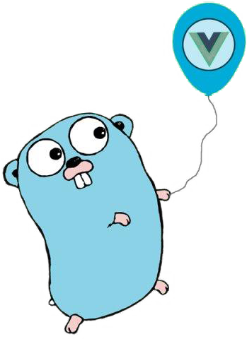

# Otus Highload. Social network



It's Otus's homework for *Highload Architect* course, which is a basic social network.
The project consists of two parts: *Backend* and *Frontend*.
- Backend part was written with **Golang** using 1.15 version. 
- Frontend part was written with **VueJS** using 2.6.12 version.

The social network allows:
- SignUp/SignIn/Authorize users in system;
- Get other user's questioners;

Authorization result represents of two JWT's: access & refresh.

## Launch project 

### Requirements
- Docker & docker-compose

### Up infrastructure
```shell script
make up
```

### Shutting down infrastructure
```shell script
make down
```

