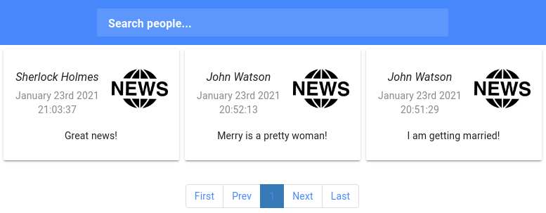

# Websockets

## Содержание
1. [ Задание ](#task)
    - [ Цель ](#task-goal)
    - [ Приобретенные навыки ](#task-skills)
    - [ Постановка задачи ](#task-statement)
2. [ Сведения ](#information)
    - [ Используемые инструменты ](#information-tools)
    - [ Характеристики железа ](#information-computer)
3. [ Ход работы ](#work)
   - [ Демонстрация работы функционала ](#work-functionality)
      - [ Регистрация пользователей ](#work-functionality-sing-up)
      - [ Отправка заявок в друзья и добавление друзей ](#work-functionality-followers-and-friends)
      - [ Публикация новостей ](#work-functionality-publish-news)
      - [ Просмотр "горячих"-новостей через Websocket ](#work-functionality-receive-hot-news)
      - [ Выгрузка новостей через HTTP-запрос ](#work-functionality-receive-cold-news)
   - [ Технические моменты ](#work-technical-moments)
      - [ Серверная часть ](#work-technical-moments-server)
      - [ Клиентская часть ](#work-technical-moments-client)
4. [ Итоги ](#results)


<a name="task"></a>
## Задание
Онлайн обновление ленты новостей социальной сети.

<a name="task-goal"></a>
### Цель
Реализовать механизм обновления ленты новостей социальной сети без перезагрузки страницы.

<a name="task-skills"></a>
### Приобретенные навыки
В результате выполненного задания необходимо приобрести следующие навыки:
- работа с Websockets на стороне клиента и сервера;
- реактивное обновление компонентов на стороне клиента;
- работа с очередями;
- проектирование масштабируемых архитектур.

<a name="task-statement"></a>
### Постановка задачи
Реализовать функционал обновления ленты социальной сети с помощью Websockets. 

При этом клиентская сторона должна:
- при переходе на вкладку **news** или **profile** установить websocket-соединение с сервером для отправки новостей 
(если находимся на вкладке **profile**) или получения предназначенных пользователю новостей от его друзей (если 
находимся на вкладке **news**);
- при переходе на другие вкладки или страницы websocket-соединение должно быть закрыто;
- при отправке новости на вкладке **profile** клиентская сторона должна отправить сообщение по websocket-соединению 
серверу;
- при получении предназначенной пользователю новости по websocket-соединению на вкладке **news** клиентская сторона
обязана реактивно обновить перечень новостей на странице.

При этом серверная сторона должна:
- вести учет подключений по websocket'у (репозиторий с Mutex возможностями) и идентифицировать каждое из них для 
дальнейшей отправке новостей ожидающему пользователю;
- при получении сообщений через websocket публиковать в очередь Nats-Streaming;
- парсить сообщения полученные через очередь и осуществлять отправку новостей конечным пользователям (друзьям), 
websocket-соединения которых активны.

<a name="information"></a>
## Сведения
<a name="information-tools"></a>
### Используемые инструменты
Для выполнения задания понадобятся следующие инструменты:
- [docker](https://docs.docker.com/get-docker/) (>= version 19.03.8) & [docker compose](https://docs.docker.com/compose/install/) (>= version 1.25.5);
- [jq](https://stedolan.github.io/jq/download/) (>= version 1.5)

<a name="information-computer"></a>
### Характеристики железа
Задание выполнялось на железе со следующими характеристиками:
- CPU - AMD Ryzen 9: 12 ядер 24 потока;
- RAM - 2xHyperX Fury Black: DDR4 DIMM 3000MHz 8GB;
- SSD - Intel® SSD 540s Series: 480GB, 2.5in SATA 6Gb/s, 16nm, TLC

<a name="work"></a>
## Ход работы
В ходе выполнения задания в качестве кеша для новостной ленты социальной сети выступает [Redis](https://redis.io/), в 
качестве очереди [Nats-Streaming](https://docs.nats.io/nats-streaming-concepts/intro), а в качестве библиотеки для 
подключения по websocket'у [gobwas/ws](https://github.com/gobwas/ws).

Склонируем наш проект:
```shell
git clone https://github.com/teploff/otus-highload.git && cd otus-highload
```

Поднимем всю инфраструктуру и применим миграции:
```shell
make db && make migrate && make up
```

<a name="work-functionality"></a>
### Демонстрация работы функционала
В данной демонстрации будут приведены HTTP-запросы (запросы будут осуществляться утилитой [curl](https://curl.se/)) и
websocket-действия (действия будут осуществляться утилитой [websocat](https://github.com/vi/websocat) в силу своей 
эффективности и наглядности. 

> Однако в каждом пункте будет дана вот такая ремарка, как это сделать при помощи WebUI.

<a name="work-functionality-sing-up"></a>
### Регистрация пользователей
Прежде всего необходимо зарегистрировать пользователей.

Зарегистрируем трех пользователей в системе:
- Шерлока Холмса,
- Доктора Ватсона,
- Джеймса Мориарти.

```shell script
curl -X POST -H "Content-Type: application/json" \
    -d '{"email": "holmes@gmail.com", "password": "12345678", "name": "Sherlock", "surname": "Holmes", "birthday": "1854-01-09T20:21:25+00:00", "sex": "male", "city": "London", "interests": "the violin, smoking, investigation"}' \
    http://localhost:9999/auth/sign-up
curl -X POST -H "Content-Type: application/json" \
    -d '{"email": "watson@gmail.com", "password": "12345678", "name": "John", "surname": "Watson", "birthday": "1852-08-07T20:21:25+00:00", "sex": "male", "city": "London", "interests": "to heal people, investigation"}' \
    http://localhost:9999/auth/sign-up
curl -X POST -H "Content-Type: application/json" \
    -d '{"email": "moriarty@gmail.com", "password": "12345678", "name": "James", "surname": "Moriarty", "birthday": "1835-05-01T20:21:25+00:00", "sex": "male", "city": "London", "interests": "the crime"}' \
    http://localhost:9999/auth/sign-up
```

Получим access token'ы от системы для наших пользователей и запишем их в переменные окружения:
```shell script
export HOLMES_ACCESS_TOKEN=$(curl -X POST -H "Content-Type: application/json" \
-d '{"email": "holmes@gmail.com", "password": "12345678"}' \
http://localhost:9999/auth/sign-in | jq -r '.access_token')
export WATSON_ACCESS_TOKEN=$(curl -X POST -H "Content-Type: application/json" \
-d '{"email": "watson@gmail.com", "password": "12345678"}' \
http://localhost:9999/auth/sign-in | jq -r '.access_token')
export MORIARTY_ACCESS_TOKEN=$(curl -X POST -H "Content-Type: application/json" \
-d '{"email": "moriarty@gmail.com", "password": "12345678"}' \
http://localhost:9999/auth/sign-in | jq -r '.access_token')
```

Проверим наличие access token-ов:
```shell script
echo $HOLMES_ACCESS_TOKEN
echo $WATSON_ACCESS_TOKEN
echo $MORIARTY_ACCESS_TOKEN
```

Получим ID-шники созданных пользователей, они нам пригодятся для отправки заявок в друзья и их подтверждении:
```shell script
export HOLMES_ID=$(curl -X GET -H "Content-Type: application/json" -H "Authorization: ${WATSON_ACCESS_TOKEN}" \
    http://localhost:9999/auth/user?email=holmes@gmail.com | jq -r '.user_id')
export WATSON_ID=$(curl -X GET -H "Content-Type: application/json" -H "Authorization: ${HOLMES_ACCESS_TOKEN}" \
  http://localhost:9999/auth/user?email=watson@gmail.com | jq -r '.user_id')
export MORIARTY_ID=$(curl -X GET -H "Content-Type: application/json" -H "Authorization: ${HOLMES_ACCESS_TOKEN}" \
  http://localhost:9999/auth/user?email=moriarty@gmail.com | jq -r '.user_id') 
```

Проверим, что запрос успешно выполнился, применив команду:
```shell script
echo $HOLMES_ID
echo $WATSON_ID
echo $MORIARTY_ID
```

> Регистрация пользователей, расположена по адресу: http://localhost:8081/sign-up

<a name="work-functionality-followers-and-friends"></a>
### Отправка заявок в друзья и добавление друзей
Теперь давайте со стороны Доктора Ватсона и Джеймса Мориарти отправим заявки в друзья Шерлоку Холмсу:
```shell script
curl -X POST -H "Content-Type: application/json" -H "Authorization: ${WATSON_ACCESS_TOKEN}" \
    -d '{
         "friends_id": ["'"$HOLMES_ID"'"]
        }' \
    http://localhost:9999/social/create-friendship
curl -X POST -H "Content-Type: application/json" -H "Authorization: ${MORIARTY_ACCESS_TOKEN}" \
    -d '{
         "friends_id": ["'"$HOLMES_ID"'"]
        }' \
    http://localhost:9999/social/create-friendship
```

Проверим, что у Шерлока Холмса появилось 2 follower-а:
```shell script
curl -X GET -H "Content-Type: application/json" -H "Authorization: ${HOLMES_ACCESS_TOKEN}" \
    http://localhost:9999/social/followers
```

Должны получить нечто следующее:</br>
<p align="center">
    
</p>

В WebUI должны увидеть следующее:</br>
<p align="center">
    
</p>

> Для отправки заявки в друзья необходимо после входа в систему (http://localhost:8081/sign-in) набрать имя пользователя
> или его фамилию (или все вместе) в поисковой строке, расположенной в верхней части страницы (**Search people...**). 
> После ввода пользователя будут доступны анкеты пользователей, которым можно отправить заявку в друзья, нажав на кнопку
> **Add Friend**.

Подтвердим заявки в друзья, сделав follower-ов своими друзьями:
```shell script
curl -X POST -H "Content-Type: application/json" -H "Authorization: ${HOLMES_ACCESS_TOKEN}" \
    -d '{
         "friends_id": ["'"$WATSON_ID"'", "'"$MORIARTY_ID"'"]
        }' \
    http://localhost:9999/social/confirm-friendship
```

Проверим то, что у Шерлока Холмса появилось два новых друга:
```shell script
curl -X GET -H "Content-Type: application/json" -H "Authorization: ${HOLMES_ACCESS_TOKEN}" \
    http://localhost:9999/social/friends
```

Должны получить нечто следующее:</br>
<p align="center">
    
</p>

В WebUI должны увидеть следующее:</br>
<p align="center">
    
</p>

> Для того, чтобы подтвердить заявки в друзья и сделать пользователей своими друзями, необходимо перейти на страницу 
> http://localhost:8081/friends или выбрав пункт выпадающего меню слева **Friends**. Затем клацнуть на вкладку **Friend 
> Requests**. После этого будет доступна таблица подписчиков, заявки которых в друзья можно отклонить или добавить.

> Для того, чтобы просмотреть своих друзей, необходимо оставаться на вкладке **My Friends** страницы 
> http://localhost:8081/friends

<a name="work-functionality-publish-news"></a>
### Публикация новостей
Теперь необходимо проверить функционал новостей.
Под новостью понимаем маленькое сообщение или твит о том, что нового у пользователя:)
Создадим пару новостей от Доктора Ватсона и пару новостей Джеймса Мориарти, при этом будем слушать websocket со стороны
Шерлока Холмса и в конце сами от его имени пошлем новость.

Для этого установим три websocket'ных соединений со стороны Доктора Ватсона, Джеймса Мориарти и Шерлока Холмса 
соответственно. Для этого в трех терминальных окнах введем следующие команды:

В первом терминальном окне, предназначенном для Доктора Ватсона введем:
```shell script
websocat ws://localhost:9999/ws\?token=${WATSON_ACCESS_TOKEN}
```
Во втором терминальном окне, предназначенном для Джеймса Мориарти введем:
```shell script
websocat ws://localhost:9999/ws\?token=${MORIARTY_ACCESS_TOKEN}
```
и для Шерлока Холмса:
```shell script
websocat ws://localhost:9999/ws\?token=${HOLMES_ACCESS_TOKEN}
```

Отправим пару новостей от Доктора Ватсона. Находясь в терминальном окне, в котором открыто websocket-соединение Доктора
Ватсона с сервером, отправим новости-сообщения:
```shell script
{"topic":"news","payload":"{\"content\":\"I am getting married!\"}"}
{"topic":"news","payload":"{\"content\":\"Merry is a pretty woman!\"}"}
```

Теперь перейдем в терминал Джеймса Мориарти, в котором открыто websocket-соединение и отправим пару новостей:
```shell script
{"topic":"news","payload":"{\"content\":\"I am a nightmare!\"}"}
{"topic":"news","payload":"{\"content\":\"Holmes, you are lost!\"}"}
```

> Для того, чтобы создать новость, необходимо перейти на страницу http://localhost:8081/. Затем ввести в поле с надписью
> **What's a new?** новость, которую вы хотите опубликовать.

<a name="work-functionality-receive-hot-news"></a>
### Просмотр "горячих"-новостей через Websocket 

Теперь перейдем в терминал Шерлока Холмса и удостоверимся, что получили все 4 новости от двух друзей. В терминале должны
увидеть следующее: </br>
<p align="center">
    
</p>

Отправим теперь новость со стороны Шерлока Холмса. Перейдем в терминал, котором открыто websocket-соединение и отправим
новость:
```shell script
{"topic":"news","payload":"{\"content\":\"Great news!\"}"}
```

В терминальных окнах, в которых открыты websocket-соединения для Доктора Ватсона и Джеймса Мориарти должны увидеть
следующее: </br>
<p align="center">
    
</p>

Закроем websokcet'ные соединения в каждом из терминальных окон командой **Ctrl+C**.

<a name="work-functionality-receive-cold-news"></a>
### Получение новостей через HTTP-запрос

Теперь запросим все доступные новости для трех наших персонажей используя HTTP-запрос.

Откроем терминал и обновим токены наших персонажей:
```shell script
export HOLMES_ACCESS_TOKEN=$(curl -X POST -H "Content-Type: application/json" \
-d '{"email": "holmes@gmail.com", "password": "12345678"}' \
http://localhost:9999/auth/sign-in | jq -r '.access_token')
export WATSON_ACCESS_TOKEN=$(curl -X POST -H "Content-Type: application/json" \
-d '{"email": "watson@gmail.com", "password": "12345678"}' \
http://localhost:9999/auth/sign-in | jq -r '.access_token')
export MORIARTY_ACCESS_TOKEN=$(curl -X POST -H "Content-Type: application/json" \
-d '{"email": "moriarty@gmail.com", "password": "12345678"}' \
http://localhost:9999/auth/sign-in | jq -r '.access_token')
```

Проверим наличие access token-ов:
```shell script
echo $HOLMES_ACCESS_TOKEN
echo $WATSON_ACCESS_TOKEN
echo $MORIARTY_ACCESS_TOKEN
```

Получим все новости доступные Доктором Ватсоном новости командой:
```shell script
curl -X GET -H "Content-Type: application/json" -H "Authorization: ${WATSON_ACCESS_TOKEN}" \
    http://localhost:9999/social/news
```

Должны получить нечто следующее:</br>
<p align="center">
    
</p>

В WebUI должны увидеть следующее:</br>
<p align="center">
    
</p>

Джеймсом Мориарти:
```shell script
curl -X GET -H "Content-Type: application/json" -H "Authorization: ${MORIARTY_ACCESS_TOKEN}" \
    http://localhost:9999/social/news
```

Должны получить нечто следующее:</br>
<p align="center">
    
</p>

В WebUI должны увидеть следующее:</br>
<p align="center">
    
</p>

И Шерлоком Холмсом:
```shell script
curl -X GET -H "Content-Type: application/json" -H "Authorization: ${HOLMES_ACCESS_TOKEN}" \
    http://localhost:9999/social/news
```

Должны получить нечто следующее:</br>
<p align="center">
    
</p>

В WebUI должны увидеть следующее:</br>
<p align="center">
    
</p>

> Для того, чтобы просмотреть свои новости и новости своих друзей, необходимо перейти на страницу 
> http://localhost:8081/news.

<a name="work-technical-moments"></a>
### Технические моменты

<a name="work-technical-moments-server"></a>
### Серверная часть 
Каждое websocket-ное соединение на стороне сервера обрабатывается в отдельной go-goroutine и записывается в общий
репозиторий всех ws-соединений, которые доступны серверу. Безусловно, чтоб сделать данный репозиторий потоко-безопасным 
и не наткнуться на race-conditions, в репозитории присутствует механизм блокировки: Mutex. Структура данных хранения
такого репозитория имеет вид:
```json
"user_id_1": [ws1, ..., wsN],
...
"user_id_N": [ws1, ..., wsN]
```
Как видно из выше представленной структуры, что мы можем сразу явно идентифицировать пользователей, которые сейчас
держат websocket-ное соединение. И уже исходя из того, кто есть чей друг, отправить новость получателю в режиме 
"реального" времени:)

Отправка и получение websocket-сообщений осуществляется через очередь **Nats-Streaming** с наименованием *news* на 
стороне сервера.

<a name="work-technical-moments-client"></a>
### Клиентская часть
При получении сообщения через websocket на вкладке **news** клиентская сторона реактивно обновляет перечень новостей на
странице. Для того, чтобы сообщения, которые были получены по websocket'у с других вкладок не потерялись для этого на
стороне клиента используется store [Vuex](https://github.com/vuejs/vuex).

<a name="results"></a>
## Итоги
В ходе выполнения домашнего задания:
- был описан процесс сборки и конфигурирования программного комплекса;
- был реализован механизм отправки и получения новостей социальной сети через Websocket'ное соединение;
- был реализован функционал реактивного обновления ленты новостей социальной сети без перезагрузки страницы;
- была реализована отправка и получение websocket-сообщений через очередь на стороне сервера, что может помочь сгладить 
нагрузку при пиковых запросах.