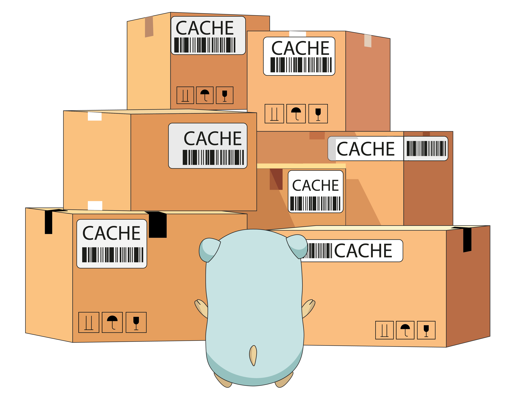

# Отчет о домашнем задании №5. Кеширование

## Содержание
1. [ Задание ](#task)
    - [ Цель ](#task-goal)
    - [ Приобретенные навыки ](#task-skills)
    - [ Постановка задачи ](#task-statement)
2. [ Сведения ](#information)
    - [ Используемые инструменты ](#information-tools)
    - [ Характеристики железа ](#information-computer)
3. [ Ход работы ](#work)
   - [ Демонстрация работы функционала ](#work-functionality)
      - [ Регистрация пользователей ](#work-functionality-sing-up)
      - [ Отправка заявок в друзья и добавление друзей ](#work-functionality-followers-and-friends)
      - [ Публикация новостей ](#work-functionality-news)
   - [ Технические моменты ](#work-functionality-technical-moments)
      - [ Первый случай прогрева кеша ](#work-technical-moments-first-heat)
      - [ Второй случай прогрева кеша ](#work-technical-moments-second-heat>)
4. [ Итоги ](#results)



<a name="task"></a>
## Задание
Кеширование ленты новостей социальной сети.

<a name="task-goal"></a>
### Цель
Реализовать механизм кеширования ленты новостей социальной сети.

<a name="task-skills"></a>
### Приобретенные навыки
В результате выполненного домашнего задания необходимо приобрести следующие навыки:
- работа с кешами;
- работа с очередями;
- проектирование масштабируемых архитектур.

<a name="task-statement"></a>
### Постановка задачи
Реализовать функционал просмотра новостей (своих и друзей) в отдельной web-странице.
Для этого необходимо:
- реализовать утверждение/отклонение заявок в друзья пользователями социальной сети;
- удаление из списка друзей;
- добавление и просмотр новостей.

Держать последние новости необходимо в горячем кеше и обновлять его через очередь, чтоб сгладить нагрузку при  пиковых 
запросах. То есть обновление идет асинхронное, но мы всегда читаем ленту из кеша. Предусмотреть механизм перестройки
кешей: инвалидация и прогрев.

<a name="information"></a>
## Сведения
<a name="information-tools"></a>
### Используемые инструменты
Для выполнения дз понадобятся следующие инструменты:
- [golang](https://golang.org/dl/) (version 1.14 or 1.15)
- [docker](https://docs.docker.com/get-docker/) (>= version 19.03.8) & [docker compose](https://docs.docker.com/compose/install/) (>= version 1.25.5);
- [jq](https://stedolan.github.io/jq/download/) (>= version 1.5)

<a name="information-computer"></a>
### Характеристики железа
Домашнее задание выполнялось на железе со следующими характеристиками:
- CPU - AMD Ryzen 9: 12 ядер 24 потока;
- RAM - 2xHyperX Fury Black: DDR4 DIMM 3000MHz 8GB;
- SSD - Intel® SSD 540s Series: 480GB, 2.5in SATA 6Gb/s, 16nm, TLC

<a name="work"></a>
## Ход работы
В ходе выполнения домашнего задания в качестве кеша выступает [Redis](https://redis.io/), а в качестве очереди 
[Nats-Streaming](https://docs.nats.io/nats-streaming-concepts/intro).

Склонируем наш проект:
```shell
git clone https://github.com/teploff/otus-highload.git && cd otus-highload
```

Поднимем всю инфраструктуру и применим миграции:
```shell
make up && make migrate
```

<a name="work-functionality"></a>
### Демонстрация работы функционала
В данной демонстрации будет использован метод API (все запросы будут осуществляться утилитой [curl](https://curl.se/)).
в силу своей эффективности и наглядности. 

> Однако в каждом пункте будет дана вот такая ремарка, как это сделать при помощи WebUI.

<a name="work-functionality-sing-up"></a>
### Регистрация пользователей
Прежде всего необходимо зарегистрировать пользователей.

Зарегистрируем трех пользователей в системе:
- Шерлока Холмса,
- Доктора Ватсона,
- Джеймса Мориарти.

```shell script
curl -X POST -H "Content-Type: application/json" \
    -d '{"email": "holmes@gmail.com", "password": "12345678", "name": "Sherlock", "surname": "Holmes", "birthday": "1854-01-09T20:21:25+00:00", "sex": "male", "city": "London", "interests": "the violin, smoking, investigation"}' \
    http://localhost:9999/auth/sign-up
curl -X POST -H "Content-Type: application/json" \
    -d '{"email": "watson@gmail.com", "password": "12345678", "name": "John", "surname": "Watson", "birthday": "1852-08-07T20:21:25+00:00", "sex": "male", "city": "London", "interests": "to heal people, investigation"}' \
    http://localhost:9999/auth/sign-up
curl -X POST -H "Content-Type: application/json" \
    -d '{"email": "moriarty@gmail.com", "password": "12345678", "name": "James", "surname": "Moriarty", "birthday": "1835-05-01T20:21:25+00:00", "sex": "male", "city": "London", "interests": "the crime"}' \
    http://localhost:9999/auth/sign-up
```

Получим access token'ы от системы для наших пользователей и запишем их в переменные окружения:
```shell script
export HOLMES_ACCESS_TOKEN=$(curl -X POST -H "Content-Type: application/json" \
-d '{"email": "holmes@gmail.com", "password": "12345678"}' \
http://localhost:9999/auth/sign-in | jq -r '.access_token')
export WATSON_ACCESS_TOKEN=$(curl -X POST -H "Content-Type: application/json" \
-d '{"email": "watson@gmail.com", "password": "12345678"}' \
http://localhost:9999/auth/sign-in | jq -r '.access_token')
export MORIARTY_ACCESS_TOKEN=$(curl -X POST -H "Content-Type: application/json" \
-d '{"email": "moriarty@gmail.com", "password": "12345678"}' \
http://localhost:9999/auth/sign-in | jq -r '.access_token')
```

Проверим наличие access token-ов:
```shell script
echo $HOLMES_ACCESS_TOKEN
echo $WATSON_ACCESS_TOKEN
echo $MORIARTY_ACCESS_TOKEN
```

Получим ID-шники созданных пользователей, они нам пригодятся для отправки заявок в друзья и их подтверждении:
```shell script
export HOLMES_ID=$(curl -X GET -H "Content-Type: application/json" -H "Authorization: ${WATSON_ACCESS_TOKEN}" \
    http://localhost:9999/auth/user?email=holmes@gmail.com | jq -r '.user_id')
export WATSON_ID=$(curl -X GET -H "Content-Type: application/json" -H "Authorization: ${HOLMES_ACCESS_TOKEN}" \
  http://localhost:9999/auth/user?email=watson@gmail.com | jq -r '.user_id')
export MORIARTY_ID=$(curl -X GET -H "Content-Type: application/json" -H "Authorization: ${HOLMES_ACCESS_TOKEN}" \
  http://localhost:9999/auth/user?email=moriarty@gmail.com | jq -r '.user_id') 
```

Проверим, что запрос успешно выполнился, применив команду:
```shell script
echo $HOLMES_ID
echo $WATSON_ID
echo $MORIARTY_ID
```

> Регистрация пользователей, расположена по адресу: http://localhost:8081/sign-up

<a name="work-functionality-followers-and-friends"></a>
### Отправка заявок в друзья и добавление друзей
Теперь давайте со стороны Доктора Ватсона и Джеймса Мориарти отправим заявки в друзья Шерлоку Холмсу:
```shell script
curl -X POST -H "Content-Type: application/json" -H "Authorization: ${WATSON_ACCESS_TOKEN}" \
    -d '{
         "friends_id": ["'"$HOLMES_ID"'"]
        }' \
    http://localhost:9999/social/create-friendship
curl -X POST -H "Content-Type: application/json" -H "Authorization: ${MORIARTY_ACCESS_TOKEN}" \
    -d '{
         "friends_id": ["'"$HOLMES_ID"'"]
        }' \
    http://localhost:9999/social/create-friendship
```

Проверим, что у Шерлока Холмса появилось 2 follower-а:
```shell script
curl -X GET -H "Content-Type: application/json" -H "Authorization: ${HOLMES_ACCESS_TOKEN}" \
    http://localhost:9999/social/followers
```

> Для отправки заявки в друзья необходимо после входа в систему (http://localhost:8081/sign-in) набрать имя пользователя
> или его фамилию (или все вместе) в поисковой строке, расположенной в верхней части страницы (**Search people...**). 
> После ввода пользователя будут доступны анкеты пользователей, которым можно отправить заявку в друзья, нажав на кнопку
> **Add Friend**.

Подтвердим заявки в друзья, сделав follower-ов своими друзьями:
```shell script
curl -X POST -H "Content-Type: application/json" -H "Authorization: ${HOLMES_ACCESS_TOKEN}" \
    -d '{
         "friends_id": ["'"$WATSON_ID"'", "'"$MORIARTY_ID"'"]
        }' \
    http://localhost:9999/social/confirm-friendship
```

Проверим то, что у Шерлока Холмса появилось два новых друга:
```shell script
curl -X GET -H "Content-Type: application/json" -H "Authorization: ${HOLMES_ACCESS_TOKEN}" \
    http://localhost:9999/social/friends
```

> Для того, чтобы подтвердить заявки в друзья и сделать пользователей своими друзями, необходимо перейти на страницу 
> http://localhost:8081/friends или выбрав пункт выпадающего меню слева **Friends**. Затем клацнуть на вкладку **Friend 
> Requests**. После этого будет доступна таблица подписчиков, заявки которых в друзья можно отклонить или добавить.

> Для того, чтобы просмотреть своих друзей, необходимо оставаться на вкладке **My Friends** страницы 
> http://localhost:8081/friends

<a name="work-functionality-news"></a>
### Публикация новостей
Теперь необходимо проверить функционал новостей.
Под новостью понимаем маленькое сообщение или твит о том, что нового у пользователя:)
Создадим пару новостей от Доктора Ватсона и пару новостей Джеймса Мориарти, также одну новость от Шерлока Холмса.
```shell script
curl -X POST -H "Content-Type: application/json" -H "Authorization: ${WATSON_ACCESS_TOKEN}" \
    -d '{
         "news": ["I am getting married!"]
        }' \
    http://localhost:9999/social/create-news
curl -X POST -H "Content-Type: application/json" -H "Authorization: ${WATSON_ACCESS_TOKEN}" \
    -d '{
         "news": ["Merry is a pretty woman!"]
        }' \
    http://localhost:9999/social/create-news
curl -X POST -H "Content-Type: application/json" -H "Authorization: ${MORIARTY_ACCESS_TOKEN}" \
    -d '{
         "news": ["I am a nightmare!", "Holmes, you are lost!"]
        }' \
    http://localhost:9999/social/create-news
curl -X POST -H "Content-Type: application/json" -H "Authorization: ${HOLMES_ACCESS_TOKEN}" \
    -d '{
         "news": ["Greate news!"]
        }' \
    http://localhost:9999/social/create-news
```

> Для того, чтобы создать новость, необходимо перейти на страницу http://localhost:8081/. Затем ввести в поле с надписью
> **What's a new?** новость, которую вы хотите опубликовать.

Теперь запросим все доступные новости для трех наших персонажей.

Доктором Ватсоном:
```shell script
curl -X GET -H "Content-Type: application/json" -H "Authorization: ${WATSON_ACCESS_TOKEN}" \
    http://localhost:9999/social/news
```

Должны получить нечто следующее:</br>
<p align="center">
    
</p>

Джеймсом Мориарти:
```shell script
curl -X GET -H "Content-Type: application/json" -H "Authorization: ${MORIARTY_ACCESS_TOKEN}" \
    http://localhost:9999/social/news
```

Должны получить нечто следующее:</br>
<p align="center">
    
</p>

И Шерлоком Холмсом:
```shell script
curl -X GET -H "Content-Type: application/json" -H "Authorization: ${HOLMES_ACCESS_TOKEN}" \
    http://localhost:9999/social/news
```

Должны получить нечто следующее:</br>
<p align="center">
    
</p>

> Для того, чтобы просмотреть свои новости и новости своих друзей, необходимо перейти на страницу 
> http://localhost:8081/news.

<a name="work-technical-moments"></a>
### Технические моменты
Инвалидация кеша осуществляется по событию. Какое-либо изменение в базе данных влечет за собой валидацию, а именно:
- добавление, удаление друзей;
- добавление новостей.

Прогрев кеша осуществляется в двух случаях:
- при старте системы (запускается джоба на прогрев кеша и только после успеха система запускается);
- при получении события из очереди (если по каким-то причинам, мы понимаем, что кеша невалидный запускаем его прогрев).

Давайте проверим это.

<a name="work-technical-moments-first-heat"></a>
### Первый случай прогрева кеша
Рассмотрим подробнее случай прогрева кеша при запуске системы.

Зайдем в Redis и полностью сброим кеш:
```shell script
docker exec -it redis-cache redis-cli
AUTH password
FLUSHALL
exit
```

Теперь пересоберем backend:
```shell script
 make reload_backend
```

После того, как backend пересобрался, перейдем в Redis и проверим BD 1 и 2 (1 - Друзья, 2 - Новости).
```shell script
docker exec -it redis-cache redis-cli
AUTH password
SELECT 1
KEYS *
SELECT 2
KEYS *
```

Должны получить нечто следующее:</br>
<p align="center">
    
</p>
Видим, что кеш при старте системы прогревается.

<a name="work-technical-moments-second-heat"></a>
### Второй случай прогрева кеша
Рассмотрим подробнее случай прогрева кеша при получении события из очереди.

Зайдем в Redis и полностью сброим кеш:
```shell script
docker exec -it redis-cache redis-cli
AUTH password
FLUSHALL
exit
```

Теперь не трогая backend, запустим простенькую tool'зу, которая в очередь шлет уведомление, на основе которого
система понимает, что необходимо заново прогреть кеш:
```shell script
cd backend/tools/cache-heater-enabler
go run main.go --addr="localhost:4222" --cluster_id="stan-cluster" --subject="cache-reload"
```

Перейдем в Redis и проверим наличие кеша:
```shell script
docker exec -it redis-cache redis-cli
AUTH password
SELECT 1
KEYS *
SELECT 2
KEYS *
```

Должны получить нечто следующее:</br>
<p align="center">
    
</p>
Видим, что кеш при отправке сообщения в очередь прогревается.

<a name="results"></a>
## Итоги
В ходе выполнения домашнего задания:
- был описан процесс сборки и конфигурирования программного комплекса;
- была реализована кешируемая подсистема новостей;
- была реализована подсистема друзей и подписчиков;
- было реализовано обновление кеша через очередь, что может помочь сгладить нагрузку при пиковых запросах;
- были реализованы процедуры валидации и прогрева кеша.