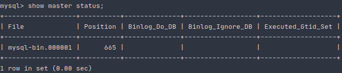
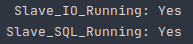

# MySQL 8.0 anysc and semisync replications 
В данном тексте идет описание того, как настроить в **MySQL 8.0** асинхронную(**async**) и полусинхронную(**semisync**) **репликацию**
при помощи **docker** и **go** версии не ниже 1.15.

# Настраиваем асинхронную(async) репликацию
### Запуск инфраструктуры
Для того, чтобы запустить в docker-ах три instance-а MySQL баз данных (один- master, два - slave-а), необходимо выполнить:
```shell script
make init
```
### Конфигурирование master-а
Заходим в master-container:
```shell script
docker exec -it storage_master bash
```

Создаем папку mysql в директории */var/log/* папку mysql и даем права доступа к ней пользователю *mysql*:
```shell script
cd /var/log && mkdir mysql && chown mysql:mysql mysql
```

Устанавливаем текстовый редактор для конфигурирования, по умолчанию редактор не идет в комплектации container-а:
```shell script
apt-get update && apt-get install nano
```

Открываем конфигурацию, которая располагается по пути **/etc/mysql/conf.d/mysql.cnf**, c помощью **nano**:
```shell script
nano /etc/mysql/conf.d/mysql.cnf
```

Дописываем в секцию **[mysqld]** следующие строки:
```textmate
[mysqld]
bind-address = storage_master
server-id = 1
default_authentication_plugin=mysql_native_password
log-bin = /var/log/mysql/mysql-bin.log
tmpdir = /tmp
binlog_format = STATEMENT
max_binlog_size = 500M
sync_binlog = 1
slow_query_log
``` 

Выходим из контейнера и рестартуем его:
```shell script
docker restart storage_master
```

Заходим опять в контейнер
```shell script
docker exec -it storage_master bash
```

Переходим в оболочку mysql и вводим *password* пароль:
```shell script
mysql -u root -p
```

Создаем пользователя для репликации:
```mysql based
create user 'replica'@'%' IDENTIFIED BY 'oTUSlave#2020';
```

Наделяем созданного пользователя полномочиями:
```mysql based
GRANT REPLICATION SLAVE ON *.* TO 'replica'@'%';
```

Вызываем команду *show master* для того, чтобы определить **MASTER_LOG_FILE** и **MASTER_LOG_POS**, которые понадобятся
нам в дальнейшем для настройки slave-ов:
```mysql based
show master status;
```

Результат может отличаться, но формат будет таким:<br />
<p align="center">
    
</p>

## Конфигурирование первого slave-а
Заходим в master-container:
```shell script
docker exec -it storage_slave_1 bash
```

Создаем папку mysql в директории */var/log/* папку mysql и даем права доступа к ней пользователю *mysql*:
```shell script
cd /var/log && mkdir mysql && chown mysql:mysql mysql
```

Устанавливаем текстовый редактор для конфигурирования, по умолчанию редактор не идет в комплектации container-а:
```shell script
apt-get update && apt-get install nano
```
Открываем конфигурацию, которая располагается по пути **/etc/mysql/conf.d/mysql.cnf**, c помощью **nano**:
```shell script
nano /etc/mysql/conf.d/mysql.cnf
```
Дописываем в секцию **[mysqld]** следующие строки:
```textmate
[mysqld]
bind-address = storage_slave_1
server-id = 2
default_authentication_plugin=mysql_native_password
log_bin = /var/log/mysql/mysql-bin.log
read_only = 1
tmpdir = /tmp
binlog_format = STATEMENT
max_binlog_size = 500M
sync_binlog = 1
slow_query_log   = 1
``` 
Выходим из контейнера и рестартуем его:
```shell script
docker restart storage_slave_1
```

Заходим опять в контейнер
```shell script
docker exec -it storage_slave_1 bash
```

Переходим в оболочку mysql и вводим *password* пароль:
```shell script
mysql -u root -p
```

Останавливаем slave-а:
```mysql based
stop slave;
```

Вносим информацию о master-е:
```mysql based
CHANGE MASTER TO
    MASTER_HOST='storage_master',
    MASTER_USER='replica',
    MASTER_PASSWORD='oTUSlave#2020',
    MASTER_LOG_FILE='mysql-bin.000001',
    MASTER_LOG_POS=665;
```

Запускаем slave:
```mysql based
start slave;
```

Выводим сводную информацию о состоянии slave-а:
```mysql based
show slave status\G
```

Если видим следующее, то все у нас в порядке:<br />
<p align="center">
    
</p>

### Конфигурирование второго slave-а
Заходим в master-container:
```shell script
docker exec -it storage_slave_2 bash
```

Создаем папку mysql в директории */var/log/* папку mysql и даем права доступа к ней пользователю *mysql*:
```shell script
cd /var/log && mkdir mysql && chown mysql:mysql mysql
```

Устанавливаем текстовый редактор для конфигурирования, по умолчанию редактор не идет в комплектации container-а:
```shell script
apt-get update && apt-get install nano
```

Открываем конфигурацию, которая располагается по пути **/etc/mysql/conf.d/mysql.cnf**, c помощью **nano**:
```shell script
nano /etc/mysql/conf.d/mysql.cnf
```

Дописываем в секцию **[mysqld]** следующие строки:
```textmate
[mysqld]
bind-address = storage_slave_2
server-id = 3
default_authentication_plugin=mysql_native_password
log_bin = /var/log/mysql/mysql-bin.log
read_only = 1
tmpdir = /tmp
binlog_format = STATEMENT
max_binlog_size = 500M
sync_binlog = 1
slow_query_log   = 1
``` 

Выходим из контейнера и рестартуем его:
```shell script
docker restart storage_slave_2
```

Заходим опять в контейнер
```shell script
docker exec -it storage_slave_2 bash
```

Переходим в оболочку mysql и вводим *password* пароль:
```shell script
mysql -u root -p
```

Вносим информацию о master-е:
```mysql based
CHANGE MASTER TO
    MASTER_HOST='storage_master',
    MASTER_USER='replica',
    MASTER_PASSWORD='oTUSlave#2020',
    MASTER_LOG_FILE='mysql-bin.000001',
    MASTER_LOG_POS=665;
```
Запускаем slave:
```mysql based
start slave;
```

Выводим сводную информацию о состоянии slave-а:
```mysql based
show slave status\G
```

Если видим следующее, то все у нас в порядке:<br />
<p align="center">
    
</p>

## Применение миграций
Еще одним хорошим способом проверки работы реплик является применение на мастере миграций.
Для того, чтобы накатить миграции выполним:
```shell script
make migrate
```
Теперь перейдем в контейнеры slave-ов и проверим, что в базе данных *social-network* появились таблицы.
Ниже представлен пример для первого slave-а.
```shell script
docker exec -it storage_slave_1 bash
mysql -u root -p
```
```mysql based
use social-network;
show tables;
```
И должны увидеть следующее:<br />
<p align="center">
  
</p>