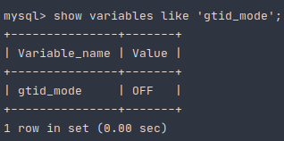
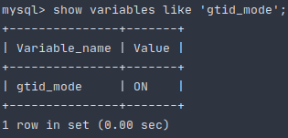
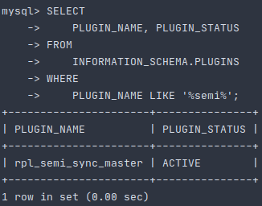
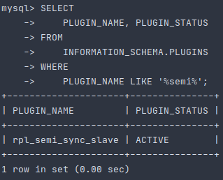

# Отчет о домашнем задании №3
## Содержание
1. [ Задание ](#task)
2. [ Сведения ](#information)
3. [ Настройка асинхронной(async) репликации ](#async-replica)
    - [ Запуск трех независимых узлов MySQL ](#launch-databases)
    - [ Конфигурирование master-а ](#master-config)
    - [ Конфигурирование первого slave-а](#first-slave-config)
    - [ Конфигурирование второго slave-а](#second-slave-config)
4. [ Применение миграций ](#migration)
5. [ Нагрузочное тестирование на чтение](#read-stress-testing)
    - [ Подготовка ](#read-stress-testing-preparation)
    - [ Выполнение ](#read-stress-testing-implementation)
    - [ Результаты ](#results-stress-testing-implementation)
6. [ Подключение row based binary logging format ](#enable-row-based)
7. [ Подключение GTID ](#gtid)
8. [ Настроить полусинхронную репликацию ](#semi-sync-replica)
9. [ Создать нагрузку на запись ](#write-stress-testing)
    - [ Подготовка ](#write-stress-testing-preparation)
    - [ Выполнение ](#write-stress-testing-implementation)
10. [ Назначение нового master-узла ](#master-promoting)

<a name="task"></a>
## Задание
1. Настроить асинхронную репликацию, в которой будет 2 slave-а и 1 master.
2. Выбрать 2 самых тяжелых по работе на стороне backend-а запроса.
3. Провести нагрузочное тестирование и измерить нагрузку master-узла MySQL (CPU, la, disc usage, memory usage) до и
после перевода нагрузки на чтение со slave-узла MySQL.
4. Включить:
    - row-based репликацию;
    - GTID;
6. Настроить полусинхронную репликацию.
7. Создать нагрузку на запись, при этом: 
    - считать сколько мы успешно сделали записей;
    - до момента окончания нагрузки на запись убить master-узел MySQL.
8. Назначить одним из существующих slave-узлов master-ом.
9. Проверить, есть ли потери транзакции.

<a name="information"></a>
## Сведения
Для выполнения дз понадобятся следующие инструменты: 
- docker (>= version 19.03.8) & docker compose (>= version 1.25.5);
- golang (>= version 1.15)
- python (>= version 3.6)
- jq

Настройка репликации, проведение нагрузочного тестирования и т.д. проводились на ПО со следующими характеристиками:
- CPU - AMD Ryzen 9: 12 ядер 24 потока;
- RAM - 2xHyperX Fury Black: DDR4 DIMM 3000MHz 8GB;
- SSD - Intel® SSD 540s Series: 480GB, 2.5in SATA 6Gb/s, 16nm, TLC

<a name="async-replica"></a>
## Настройка асинхронной(async) репликации

<a name="launch-databases"></a>
### Запуск трех независимых узлов MySQL
Для того, чтобы запустить в docker-ах три instance-а MySQL баз данных(которые в дальнейшем станут двумя slave-ами и 
одним master-ом), необходимо выполнить:
```shell script
make init
```

<a name="master-config"></a>
### Конфигурирование master-а
Заходим в master-container:
```shell script
docker exec -it storage_master bash
```

Создаем папку mysql в директории */var/log/* папку mysql и даем права доступа к ней пользователю *mysql*:
```shell script
cd /var/log && mkdir mysql && chown mysql:mysql mysql
```

Устанавливаем текстовый редактор для конфигурирования, по умолчанию редактор не идет в комплектации container-а:
```shell script
apt-get update && apt-get install nano
```

Открываем конфигурацию, которая располагается по пути **/etc/mysql/conf.d/mysql.cnf**, c помощью **nano**:
```shell script
nano /etc/mysql/conf.d/mysql.cnf
```

Дописываем в секцию **[mysqld]** следующие строки:
```textmate
[mysqld]
bind-address = storage_master
server-id = 1
default_authentication_plugin=mysql_native_password
log-bin = /var/log/mysql/mysql-bin.log
tmpdir = /tmp
binlog_format = STATEMENT
max_binlog_size = 500M
sync_binlog = 1
slow_query_log
``` 

Выходим из контейнера и рестартуем его:
```shell script
docker restart storage_master
```

Заходим опять в контейнер
```shell script
docker exec -it storage_master bash
```

Переходим в оболочку mysql и вводим *password* пароль:
```shell script
mysql -u root -p
```

Создаем пользователя для репликации:
```mysql based
create user 'replica'@'%' IDENTIFIED BY 'oTUSlave#2020';
```

Наделяем созданного пользователя полномочиями:
```mysql based
GRANT REPLICATION SLAVE ON *.* TO 'replica'@'%';
```

Вызываем команду *show master* для того, чтобы определить **MASTER_LOG_FILE** и **MASTER_LOG_POS**, которые понадобятся
нам в дальнейшем для настройки slave-ов:
```mysql based
show master status;
```

Результат может отличаться, но формат будет таким:<br />
<p align="center">
    
</p>

<a name="first-slave-config"></a>
## Конфигурирование первого slave-а
Заходим в master-container:
```shell script
docker exec -it storage_slave_1 bash
```

Создаем папку mysql в директории */var/log/* папку mysql и даем права доступа к ней пользователю *mysql*:
```shell script
cd /var/log && mkdir mysql && chown mysql:mysql mysql
```

Устанавливаем текстовый редактор для конфигурирования, по умолчанию редактор не идет в комплектации container-а:
```shell script
apt-get update && apt-get install nano
```
Открываем конфигурацию, которая располагается по пути **/etc/mysql/conf.d/mysql.cnf**, c помощью **nano**:
```shell script
nano /etc/mysql/conf.d/mysql.cnf
```
Дописываем в секцию **[mysqld]** следующие строки:
```textmate
[mysqld]
bind-address = storage_slave_1
server-id = 2
default_authentication_plugin=mysql_native_password
log_bin = /var/log/mysql/mysql-bin.log
tmpdir = /tmp
binlog_format = STATEMENT
max_binlog_size = 500M
sync_binlog = 1
slow_query_log   = 1
``` 
Выходим из контейнера и рестартуем его:
```shell script
docker restart storage_slave_1
```

Заходим опять в контейнер
```shell script
docker exec -it storage_slave_1 bash
```

Переходим в оболочку mysql и вводим *password* пароль:
```shell script
mysql -u root -p
```

Вносим информацию о master-е:
```mysql based
CHANGE MASTER TO
    MASTER_HOST='storage_master',
    MASTER_USER='replica',
    MASTER_PASSWORD='oTUSlave#2020',
    MASTER_LOG_FILE='mysql-bin.000001',
    MASTER_LOG_POS=665;
```

Запускаем slave:
```mysql based
start slave;
```

Выводим сводную информацию о состоянии slave-а:
```mysql based
show slave status\G
```

Если видим следующее, то все у нас в порядке:<br />
<p align="center">
    
</p>

<a name="second-slave-config"></a>
### Конфигурирование второго slave-а
Заходим в master-container:
```shell script
docker exec -it storage_slave_2 bash
```

Создаем папку mysql в директории */var/log/* папку mysql и даем права доступа к ней пользователю *mysql*:
```shell script
cd /var/log && mkdir mysql && chown mysql:mysql mysql
```

Устанавливаем текстовый редактор для конфигурирования, по умолчанию редактор не идет в комплектации container-а:
```shell script
apt-get update && apt-get install nano
```

Открываем конфигурацию, которая располагается по пути **/etc/mysql/conf.d/mysql.cnf**, c помощью **nano**:
```shell script
nano /etc/mysql/conf.d/mysql.cnf
```

Дописываем в секцию **[mysqld]** следующие строки:
```textmate
[mysqld]
bind-address = storage_slave_2
server-id = 3
default_authentication_plugin=mysql_native_password
log_bin = /var/log/mysql/mysql-bin.log
tmpdir = /tmp
binlog_format = STATEMENT
max_binlog_size = 500M
sync_binlog = 1
slow_query_log   = 1
``` 

Выходим из контейнера и рестартуем его:
```shell script
docker restart storage_slave_2
```

Заходим опять в контейнер
```shell script
docker exec -it storage_slave_2 bash
```

Переходим в оболочку mysql и вводим *password* пароль:
```shell script
mysql -u root -p
```

Вносим информацию о master-е:
```mysql based
CHANGE MASTER TO
    MASTER_HOST='storage_master',
    MASTER_USER='replica',
    MASTER_PASSWORD='oTUSlave#2020',
    MASTER_LOG_FILE='mysql-bin.000001',
    MASTER_LOG_POS=665;
```
Запускаем slave:
```mysql based
start slave;
```

Выводим сводную информацию о состоянии slave-а:
```mysql based
show slave status\G
```

Если видим следующее, то все у нас в порядке:<br />
<p align="center">
    
</p>

<a name="migration"></a>
## Применение миграций
Еще одним хорошим способом проверки работы реплик является применение на мастере миграций.
Для того, чтобы накатить миграции выполним:
```shell script
make migrate
```
Теперь перейдем в контейнеры slave-ов и проверим, что в базе данных *social-network* появились таблицы.
Ниже представлен пример для первого slave-а.
```shell script
docker exec -it storage_slave_1 bash
mysql -u root -p
```
```mysql based
use social-network;
show tables;
```
И должны увидеть следующее:<br />
<p align="center">
  
</p>

<a name="read-stress-testing"></a>
## Нагрузочное тестирование на чтение
Необходимо с помощью утилиты [wrk](https://github.com/wg/wrk) реализовать нагрузочный тест, который бы состоял из двух
тяжелых запросов на чтение с сайта.

Под это требования отлично подойдет поиск анкет пользователей, имя и фамилия которых начинаются на заданную подстроку 
(предыдущее домашнее задание). В качестве подстроки выберем те строки, при мощи которых Backend вернет наибольшее
количество анкет. В моем случае, это подстрока *m* и *j*, для которых результат поиска будут равны 10500 и 7451 анкет
соответственно.

<a name="read-stress-testing-preparation"></a>
### Подготовка
Для осуществления нагрузочного тестирования необходимы данные, на основе которых будет происходить выборка.
В качестве данных подойдут сгенерированные пользователи(1 миллион), которые были получены в предыдущем домашнем задании.

Для этого воспользуемся написанным нами [insert-ом](https://github.com/teploff/otus-highload/tree/main/tools/inserter).
Распакуем data-set'ы и запишем сгенерированных пользователей, которые были получены утилитой 
[generator](https://github.com/teploff/otus-highload/tree/main/tools/generator):
```shell script
cd ../tools/inserter/
mkdir snapshot
tar -xzf ../generator/snapshot/data_set_1.tar.gz -C ./snapshot
tar -xzf ../generator/snapshot/data_set_2.tar.gz -C ./snapshot
python3 -m venv venv
source venv/bin/activate
pip install -r requirements.txt
python main.py -cfg=./config.yaml -path=./snapshot -size=10000
deactivate
rm -rf ./snapshot ./venv
cd ../../cluster/
```

Проверяем, например, на втором slave-е, что сгенерированные пользователи записались и их число 1м:
```shell script
docker exec -it storage_slave_2 bash
mysql -u root -p
```

Затем в оболочке MySQL:
```mysql based
use social-network;
select count(*) from user;
```

Если все указали корректно, должны увидеть следующее:
<p align="center">
  
</p>

Запускаем backend mater-node на запись:
```shell script
make launch_backend_wmn
```

Регистрируем тестового пользователя и получаем его access_token, который понадобится для осуществления нагрузочного 
тестирования:
```shell script
curl -X POST -H "Content-Type: application/json" \
    -d '{"email": "user@user.ru", "password": "1234567890", "name": "Test", "surname": "Test", "birthday": "1994-04-10T20:21:25+00:00", "sex": "male", "city": "Moscow", "interests": "programming"}' \
    http://localhost:9999/auth/sign-up
export ACCESS_TOKEN=$(curl -X POST -H "Content-Type: application/json" \
    -d '{"email": "user@user.ru", "password": "1234567890"}' \
    http://localhost:9999/auth/sign-in | jq '.access_token')
```

<a name="read-stress-testing-implementation"></a>
### Выполнение
Запускаем нагрузочные тесты из двух разных терминалов:
```shell script
make wrk_1
```
```shell script
make wrk_2
```

Замеряем нагрузку на master-node:
```shell script
docker stats storage_master > master_dump_before.txt
```
Ждем окончания нагрузочного теста, который идет 60s и так же жмем Ctrl + C.

Перезапускаем backend, но уже на slave-node, который только лишь на чтение:
```shell script
make down_backend_wmn
make launch_backend_wsn
```

Запускаем нагрузочные тесты из двух разных терминалов:
```shell script
make wrk_1
```
```shell script
make wrk_2
```

Замеряем нагрузку на master-node:
```shell script
docker stats storage_master > master_dump_after.txt
```
Ждем окончания нагрузочного теста, который идет 60s и так же жмем Ctrl + C.

<a name="results-stress-testing-implementation"></a>
## Результаты
Детально с результатами метрик нагрузки на master можно ознакомиться [тут](https://github.com/teploff/otus-highload/tree/main/cluster/metrics).
Из результатов видно, что при переводе нагрузки с master на slave нагрузка на:
- CPU упала c ***~ 995.11%*** на ***~ 0.09%***;
- RAM упала с ***~ 3.12%*** на ***~ 3.10%***;
- NET I/O возросла с ***~ 435MB / 985MB*** на ***~ 440MB / 1.85GB***;
- BLOCK I/O возросла с ***~ 127MB / 3.81GB*** на ***~ 131MB / 3.81GB***;

<a name="enable-row-based"></a>
## Подключение row based binary logging format
Для того, чтобы понять, какой именно сейчас у нас стоит тип для binary logging format-a, необходимо зайти в каждый из
docker-контейнеров, перейти в оболочку mysql и выполнить:
```mysql based
show variables like 'binlog_format';
```
Во всех трех docker-container-ах должны увидеть следующее:<br />
<p align="center">

</p>

Для того, чтобы поменять STATEMENT binary logging format на ROW, необходимо: 
- перейти в каждый из docker container-ов MySQL;
```shell script
docker exec -it storage_master bash
docker exec -it storage_slave_1 bash
docker exec -it storage_slave_2 bash
```
- открыть конфигурацию, располагающуюся по пути: **/etc/mysql/conf.d/mysql.cnf**;
- изменить строку **binlog_format = STATEMENT** на **binlog_format = ROW**;
- перезапустить каждый из контейнеров:
```shell script
docker restart storage_master
docker restart storage_slave_1
docker restart storage_slave_2
```
При успешном конфигурировании во всех трех docker-container-ах должны увидеть следующее:
```mysql based
show variables like 'binlog_format';
```
<p align="center">

</p>

<a name="gtid"></a>
## Подключение GTID
Для того, чтобы понять, включен ли у нас режим GTID, необходимо зайти в каждый из docker-контейнеров, перейти в 
оболочку mysql и выполнить:
```mysql based
show variables like 'gtid_mode';
```
Во всех трех docker-container-ах должны увидеть следующее:<br />
<p align="center">

</p>

Для того, чтобы поменять GTID mode с OFF на ON, необходимо: 
- перейти в каждый из docker container-ов MySQL;
```shell script
docker exec -it storage_master bash
docker exec -it storage_slave_1 bash
docker exec -it storage_slave_2 bash
```
- открыть конфигурацию, располагающуюся по пути: **/etc/mysql/conf.d/mysql.cnf**;
- вконец добавить строки 
```text
[mysqld]
gtid_mode = on
enforce_gtid_consistency = true
```
- перезапустить каждый из контейнеров:
```shell script
docker restart storage_master
docker restart storage_slave_1
docker restart storage_slave_2
```
При успешном конфигурировании во всех трех docker-container-ах должны увидеть следующее:
```mysql based
show variables like 'gtid_mode';
```
<p align="center">

</p>

Переходим на каждый из slave-ов, далее в оболочку MySQL и выполняем следующее:
```mysql based
STOP SLAVE;
CHANGE MASTER TO MASTER_AUTO_POSITION = 1;
START SLAVE;
```

<a name="semi-sync-replica"></a>
## Настроить полусинхронную репликацию
Переходим на master, затем в mysql оболочку и применяем команду:
```mysql based
INSTALL PLUGIN rpl_semi_sync_master SONAME 'semisync_master.so';
```

Так же переходим на каждую salve реплику и применяем команду:
```mysql based
INSTALL PLUGIN rpl_semi_sync_slave SONAME 'semisync_slave.so';
```

Если все прошло успешно, то на master при введении команды:
```mysql based
SELECT
    PLUGIN_NAME, PLUGIN_STATUS
FROM
    INFORMATION_SCHEMA.PLUGINS
WHERE
    PLUGIN_NAME LIKE '%semi%';
```

Должны увидеть следующее:
<p align="center">

</p>


А на slave узлах при введении той же команды должны увидеть:
<p align="center">

</p>

Так же необходимо в конфигурации master узла(располагающуюся по пути: **/etc/mysql/conf.d/mysql.cnf**) задать параметры **включения режима репликации** и 
**время ожидания ответа в мс**
```shell script
[mysqld]
rpl_semi_sync_master_enabled=1
rpl_semi_sync_master_timeout=1000 # 1 second
```

А так же на slave-ах:
```shell script
[mysqld]
rpl_semi_sync_slave_enabled=1
```

И перезапускаем docker container-ы:
```shell script
docker restart storage_master
docker restart storage_slave_1
docker restart storage_slave_2
```

Проверяем, что конфигурация принялась успешно.
На master-е в оболочке MySQL выполняем команду:
```mysql based
show variables like 'rpl_semi_sync_master_enabled';
show variables like 'rpl_semi_sync_master_timeout';
```
Если все ок, то вывод будет таким:<br/>
<p align="center">

</p>

На slave-ах в оболочке MySQL выполняем команду:
```mysql based
show variables like 'rpl_semi_sync_slave_enabled';
```
Если все ок, то вывод будет таким:
<p align="center">

</p>

<a name="write-stress-testing"></a>
## Создать нагрузку на запись
<a name="write-stress-testing-preparation"></a>
### Подготовка 
Повторим сборку кластера для репликации, пропуская при этом шаг 
[нагрузочного тестирования на чтение](#read-stress-testing), и переходим сразу на выполнение нагрузочного теста на
запись.
<a name="write-stress-testing-implementation"></a>
### Выполнение
Для осуществления нагрузки на запись, так же воспользуемся [insert-ом](https://github.com/teploff/otus-highload/tree/main/tools/inserter).
Распакуем data-set и запишем сгенерированных пользователей, которые были получены утилитой 
[generator](https://github.com/teploff/otus-highload/tree/main/tools/generator):
```shell script
cd ../tools/inserter/
mkdir snapshot
tar -xzf ../generator/snapshot/data_set_3.tar.gz -C ./snapshot
python3 -m venv venv
source venv/bin/activate
pip install -r requirements.txt
python main.py -cfg=./config.yaml -path=./snapshot -size=1
deactivate
rm -rf ./snapshot ./venv
cd ../../cluster/
```

Убиваем master-узел командой:
```shell script
docker rm -f storage_master
```

Заканчиваем операцию записи и смотрим, сколько удалось записать срок пользователей в БД:
```text

```

Переходим в каждый из slave-узлов и удостоверяемся в отсутствии подключения к master-узлу:
```shell script
show slave status\G
```
Должны на каждом из slave-узле увидеть следующую ошибку:
<br/>
<p align="center">

</p>

<a name="master-promoting)"></a>
## Назначение нового master-узла 
Переходим на тот slave-узел, которых хотим назначить master-ом, например, storage_slave_1:
```shell script
docker exec -it storage_slave_1 bash
mysql -u root -p
```

Останавливаем режим SLAVE:
```mysql based
stop slave;
```

Создаем пользователя для репликации:
```mysql based
create user 'replica'@'%' IDENTIFIED BY 'oTUSlave#2020';
```

Наделяем созданного пользователя полномочиями:
```mysql based
GRANT REPLICATION SLAVE ON *.* TO 'replica'@'%';
```

Перенастраиваем master на себя:
```mysql based
reset master;
```

Выходим из docker container-а и заходим в контейнер storage_slave_2, в оболочку mysql:
```mysql based
stop slave;
CHANGE MASTER TO MASTER_HOST='storage_slave_1';
```

Проверяем, что на slave-узле, все работает и ему удалось подсоединиться к новому master-у:
```mysql based
show slave status\G
```

Если все настроили корректно, должны увидеть следующее:<br/>
<p align="center">

</p>

           Retrieved_Gtid_Set: 2cd47c18-2755-11eb-8446-0242ac160003:1-1369
           Executed_Gtid_Set: 2cd47c18-2755-11eb-8446-0242ac160003:1-1369

show variables like 'gtid_executed';