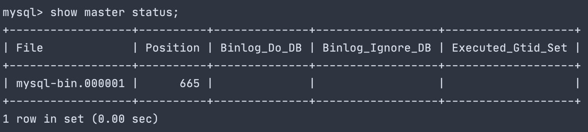
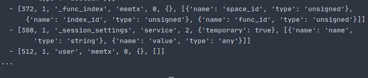
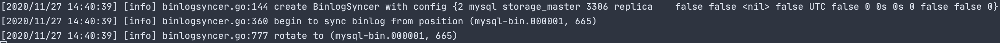
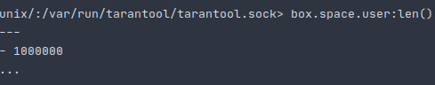
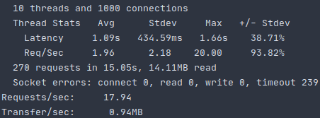
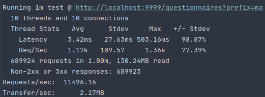

# Отчет о домашнем задании №6
<p align="center">

</p>

## Содержание
1. [ Задание ](#task)
    - [ Цель ](#task-goal)
    - [ Приобретенные навыки ](#task-skills)
    - [ Постановка задачи ](#task-statement)
2. [ Сведения ](#information)
    - [ Используемые инструменты ](#information-tools)
    - [ Характеристики железа ](#information-computer)
    - [ Причина отказа от утилиты mysql-tarantool-replication ](#task-cause)
3. [ Настройка репликации ](#replication)
    - [ Настройка master-узла MySQL ](#replication-mysql)
    - [ Настройка slave-узла tarantool ](#replication-tarantool)
    - [ Настройка replicator-а ](#replication-replicator)
4. [ Нагрузочное тестирование на чтение ](#stress-testing)
    - [ Подготовка ](#stress-testing-preparation)
    - [ Выполнение ](#stress-testing-implementation)
    - [ Результаты ](#stress-testing-results)
5. [ Итоги ](#results)

<a name="task"></a>
## Задание
Репликация из MySQL в tarantool.

<a name="task-goal"></a>
### Цель
Настроить репликацию из MySQL в tarantool и написать lua-script для осуществления выборки из tarantool-а путем 
применения хранимой процедуры.

<a name="task-skills"></a>
### Приобретенные навыки
В результате выполненного домашнего задания необходимо приобрести следующие навыки:
- администрирование MySQL;
- администрирование tarantool;
- разработка хранимых процедур для tarantool.

<a name="task-statement"></a>
### Постановка задачи
1. Выбрать любую таблицу, которую мы читаем с реплик MySQL.
2. С помощью [утилиты](https://github.com/tarantool/mysql-tarantool-replication) настроить реплицирование в tarantool
(лучше всего версии 1.10).
3. Выбрать любой запрос, переписать его на lua-процедуру и поместить его в tarantool.
4. Провести нагрузочное тестирование, сравнить tarantool и MySQL по производительности.

<a name="information"></a>
## Сведения

<a name="information-tools"></a>
### Используемые инструменты
Для выполнения дз понадобятся следующие инструменты: 
- [docker](https://docs.docker.com/get-docker/) (>= version 19.03.8) & [docker compose](https://docs.docker.com/compose/install/) (>= version 1.25.5);
- [python](https://www.python.org/downloads/) (>= version 3.6)
- [jq](https://stedolan.github.io/jq/download/) (>= version 1.5)

<a name="information-computer"></a>
### Характеристики железа
Настройка репликации, проведение нагрузочного тестирования и т.д. проводились на железе со следующими характеристиками:
- CPU - AMD Ryzen 9: 12 ядер 24 потока;
- RAM - 2xHyperX Fury Black: DDR4 DIMM 3000MHz 8GB;
- SSD - Intel® SSD 540s Series: 480GB, 2.5in SATA 6Gb/s, 16nm, TLC

<a name="task-cause"></a>
### Причина отказа от утилиты mysql-tarantool-replication
Тема довольно болезненная, однако важная для ее освещения. Постараюсь конструктивно изложить суть проблемы.
Потратив неделю безнадежного поиска причин и устранения проблем на стороне утилиты [replacator](https://github.com/tarantool/mysql-tarantool-replication),
пришел к выводу, что данная утилита полностью не актуальна и не рабочая. По следующему ряду причин:
- репозиторий попросту протухший, последний core-commit совершался более 4-х лет назад;
- были перепробованы все доступные версии MySQL на момент времени 26.11.20 и ни с одной версией [replacator](https://github.com/tarantool/mysql-tarantool-replication)
не заработал;
- [replacator](https://github.com/tarantool/mysql-tarantool-replication) собирается ТОЛЬКО на centos версии 7 и никак
иначе. В противном случае (если вы попытаетесь собрать на другой версии CentOS или на той же Ubuntu) необходимо лезть в 
сурсы и править код;
- отсутствие Docker-а (авторы прямым текстом говорят о том, что его нет и не будет - [proov](https://github.com/tarantool/mysql-tarantool-replication/pull/21));
- tutorial, который приведен [тут](https://www.tarantool.io/ru/learn/improving-mysql/), полностью противоречит тому,
что происходит в действительности (многие приведенные команды попросту не работают, а инструкции, которые приведены, как
в репозитории, так и в этой статье, сбивают с толку, потому что полностью противоположны);
- в конце концов уперся в ошибки репликтора, которые поднимались другими ребятами в issue на github'е. Проблемы не были
услышаны maintainer'ами и никакого продвижения по их решению до сих пор нет. Авторы пометили, что это баг и казалось
бы на этом все;
- удалось переговорить с ребятами, которые остались не равнодушны к моей проблеме и откликнулись (написал на почту всем,
кто сделал fork от репы). Ответ был короткий, либо это не работает уже давным-давно, либо там надо собирать при нужной
фазе луны, поворачиваясь к северу, но смотря на юг. Кому-то удавалось собирать, но это было давно и сейчас никаких 
гарантий нет. На успех попросту нет. Однако я перепробовал и их все рекомендации, но увы - также все безуспешно.
- Mail в очередной раз показывает себя с ***прекрасной*** стороны и я бы все такие так же посомневался в использовании
 самого tarantool-а, не зря люди смотрят в сторону redis, думаю, по понятной причине.

Исходя из вышеописанной мной проблемы было принято решение - написать простую утилиту, которая бы позволила самым 
простым образом подписаться на event'ы из binlog'а MySQL-master-а и записать insert-инструкции в tarantool. Краткое
изложение утилиты представлено [тут](https://github.com/teploff/otus-highload/tree/main/tools/replicator).

<a name="replication"></a>
## Настройка репликации
Перед тем как перейти к настройке репликации на стороне MySQL и Tarantool необходимо поднять инфраструктуру, состоящую
из двух docker-контейнеров, а именно экземпляра MySQL и экземпляра Tarantool:
```shell script
make init
```

<a name="replication-mysql"></a>
### Настройка master-узла MySQL
Заходим в mysql-container:
```shell script
docker exec -it storage_master bash
```

Создаем папку mysql в директории /var/log/ папку mysql и даем права доступа к ней пользователю mysql:
```shell script
mkdir /var/log/mysql && chown mysql:mysql /var/log/mysql
```

Устанавливаем текстовый редактор для конфигурирования, по умолчанию редактор не идет в комплектации container-а:
```shell script
apt-get update && apt-get install nano
```

Открываем конфигурацию, которая располагается по пути **/etc/mysql/conf.d/mysql.cnf**, c помощью **nano**:
```shell script
nano /etc/mysql/conf.d/mysql.cnf
```

Дописываем в секцию **[mysqld]** следующие строки:
```textmate
[mysqld]
bind-address = storage_master
server_id = 1
log-bin = /var/log/mysql/mysql-bin.log
binlog_format = ROW
max_binlog_size = 500M
tmpdir = /tmp
interactive_timeout=3600
wait_timeout=3600
max_allowed_packet=32M
```

Выходим из контейнера и перезапускаем его:
```shell script
exit
docker restart storage_master
```

Заходим опять в контейнер
```shell script
docker exec -it storage_master bash
```

Переходим в оболочку mysql и вводим password пароль:
```shell script
mysql -u root -p
```

Создаем пользователя для репликации и наделяем его полномочиями:
```shell script
create user 'replica'@'%' IDENTIFIED BY 'oTUSlave#2020';
GRANT REPLICATION SLAVE ON *.* TO 'replica'@'%';
```

Вызываем команду show master для того, чтобы определить MASTER_LOG_FILE и MASTER_LOG_POS, которые понадобятся нам в 
дальнейшем для запуска [replicator](https://github.com/teploff/otus-highload/tree/main/tools/replicator) утилиты:
```mysql based
show master status;
```

Результат может отличаться, но формат будет таким:</br>
<p align="center">
    
</p>

Выходим из оболочки MySQL
```mysql based
exit
```
и самого docker-container'а:
```shell script
exit
```

<a name="replication-tarantool"></a>
### Настройка slave-узла tarantool
Заходим в tarantool-container:
```shell script
docker exec -it storage_tarantool sh
```

Создаем папку tarantool в директории */var/log/* и даем права доступа к ней пользователю *tarantool*:
```shell script
mkdir /var/log/tarantool && chown tarantool:tarantool /var/log/tarantool
```

Устанавливаем текстовый редактор для конфигурирования, по умолчанию редактор не идет в комплектации container-а:
```shell script
apk update && apk add nano
```

Перейдем в console, создадим space *user* и индексы:
```shell script
console
s = box.schema.space.create('user')
s:format({
  {name = 'id', type = 'string'},
  {name = 'email', type = 'string'},
  {name = 'password', type = 'string'},
  {name = 'name', type = 'string'},
  {name = 'surname', type = 'string'},
  {name = 'sex', type = 'string'},
  {name = 'birthday', type = 'string'},
  {name = 'city', type = 'string'},
  {name = 'interests', type = 'string'},
})
s:create_index('primary', {
  type = 'hash',
  parts = {'id'}
})
s:create_index('idx_name_surname', {
  type = 'tree',
  unique = false,
  parts = {
    { field = 4, type = 'string', collation = 'unicode_ci' },
    { field = 5, type = 'string', collation = 'unicode_ci' }
  }
})

```
Проверим, что space успешно создался командой:
```shell script
box.space._space:select()
```

Должны увидеть нечто следующее:</br>
<p align="center">
    
</p>

Для того, чтобы выйти из консоли, необходимо нажать **Ctrl + C** или **Ctrl + D**.

Теперь необходимо создать хранимые процедуры, которые будут нам необходимы при фильтрации пользователей по имени и 
фамилии соответственно. Для этого, находясь в container'е перейдем в директорию */opt/tarantool* и создадим файл 
*search.lua*:
```shell script
cd /opt/tarantool
nano search.lua
```

В открытый файл *search.lua* текстовым редактором nano помещаем следующие хранимые процедуры:
```shell script
function tuple_sort(a,b)
    if  a[1] < b[1] then
        return true
    end

    return false
end

function find_users_by_name_and_surname(prefix, offset, limit)
    local rows = box.space.user.index.idx_name_surname:select({prefix, prefix}, {iterator = 'GE'})
    result = {}

    for i=1, #rows do
        if string.startswith(string.lower(rows[i][4]), prefix) and string.startswith(string.lower(rows[i][5]), prefix) then
            table.insert(result, rows[i])
        end
    end
    table.sort(result, tuple_sort)

    return make_table_slice(result, offset, limit, 1), table_length(result)
end

function make_table_slice(tbl, first, last, step)
  local sliced = {}

  for i = first or 1, last or #tbl, step or 1 do
    sliced[#sliced+1] = tbl[i]
  end

  return sliced
end

function table_length(T)
  local count = 0
  
  for _ in pairs(T) do
    count = count + 1
  end

  return count
end
```

Сохраняем *search.lua* командой **Ctrl + O** и выходим из текстового редактора - **Ctrl + X**.
Теперь необходимо применить хранимую процедуру. Для этого снова переходим в оболочку tarantool:
```shell script
console
```
и применяем созданный нами файл *search.lua*:
```shell script
dofile('search.lua')
```

Выше представлена хранимая процедура *find_users_by_name_and_surname*, которая по заданному префиксу ищет пользователей,
чьи имена и фамилии начинаются на заданную подстроку. Естественно, чтоб не халтурить была написана простая функция 
*tuple_sort*, которая позволяла сортировать пользователей по их id, как и говорилось в задании ранее.

Для того, чтобы выйти из консоли, необходимо нажать **Ctrl + C** или **Ctrl + D**.

Для того, чтобы выйти из container-а, введем:
```shell script
exit
```

<a name="replication-replicator"></a>
### Настройка replicator-а
Перед тем, как запустить replicator, необходимо удостовериться, что переменные окружения для credentials MySQL, Tarantool
и значения BINLOG_FILE, BINLOG_POS соответствуют действительности. Для того, чтобы ознакомиться со значениями по
умолчанию, необходимо перейти в [docker-compose.yml](https://github.com/teploff/otus-highload/blob/main/replication/mysql_and_tarantool/docker-compose.yml)
и в секции **environment** сервиса **replicator** соотнести с действительностью.
Если все верно, то запускаем наш replicator следующей командой:
```shell script
make replicator
```
После чего пойдет непромедлительное реплицирование данных из MySQL в Tarantool.

Если запуск репликатора прошел успешно, то на команду:
```shell script
docker logs -f replicator_replica
```
должны увидеть следующее: </br>
<p align="center">
    
</p>

<a name="stress-testing"></a>
## Нагрузочное тестирование на чтение

<a name="stress-testing-preparation"></a>
### Подготовка
Прежде чем приступить к выполнению нагрузочного тестирования, необходимо произвести:
- миграции;
- создать индекс в MySQL;
- наполнить БД данными с помощью утилиты [inserter](https://github.com/teploff/otus-highload/tree/main/tools/inserter).

Для того, чтобы накатить миграции выполним команду:
```shell script
make migrate
```

Для того, чтобы создать индекс для дальнейшего поиска, перейдем в container MySQL и его оболочку соответственно:
```shell script
docker exec -it storage_master bash
mysql -u root -p
```

и создадим индексы:
```mysql based
use social-network;
create index name_surname_idx on user(name, surname);
```

Выходим из оболочки mysql
```mysql based
exit
```
и docker-contaner'а:
```shell script
exit 
```

Теперь произведем вставку 1м записей пользователей с помощью утилиты [inserter](https://github.com/teploff/otus-highload/tree/main/tools/inserter):
```shell script
cd ../../tools/inserter/
mkdir snapshot
tar -xzf ../generator/snapshot/data_set_1.tar.gz -C ./snapshot
tar -xzf ../generator/snapshot/data_set_2.tar.gz -C ./snapshot
python3 -m venv venv
source venv/bin/activate
pip install -r requirements.txt
python main.py -cfg=./config.yaml -path=./snapshot -size=1
```
Потребуется достаточно времени, чтобы данные были среплецированы. После того, как последняя запись была записана:
```shell script
deactivate
rm -rf ./snapshot ./venv
cd ../../replication/mysql_and_tarantool
```

Убедимся в том, что все записи среплицировались. Для этого перейдем в container tarantool-узла:
```shell script
docker exec -it storage_tarantool console
```
и в оболочке вызовем команду:
```shell script
box.space.user:len()
```

Если все прошло успешно, должны увидеть следующее: </br>
<p align="center">
    
</p>

Для того, чтобы выйти из консоли, по-прежнему необходимо нажать **Ctrl + C** или **Ctrl + D**.

Поднимем backend, который привязан к хранилищу MySQL:
```shell script
make backend
```

Регистрируем тестового пользователя и получаем его access_token, который понадобится для осуществления нагрузочного 
тестирования:
```shell script
curl -X POST -H "Content-Type: application/json" \
    -d '{"email": "user@user.ru", "password": "1234567890", "name": "Test", "surname": "Test", "birthday": "1994-04-10T20:21:25+00:00", "sex": "male", "city": "Moscow", "interests": "programming"}' \
    http://localhost:9999/auth/sign-up
export ACCESS_TOKEN=$(curl -X POST -H "Content-Type: application/json" \
    -d '{"email": "user@user.ru", "password": "1234567890"}' \
    http://localhost:9999/auth/sign-in | jq -r '.access_token')
```

<a name="stress-testing-implementation"></a>
### Выполнение
Запускаем нагрузочное тестирование на backend, который в качестве хранилища использует MySQL.
Тестирование представляет собой поиск пользователей, у которых name и surname начинаются на **ma** одновременно:
```shell script
make wrk
```

Результат получился следующим:</br>
<p align="center">
  
</p>

Теперь необходимо произвести нагрузочное тестирование на backend, но уже в качестве хранилища использовать не MySQL, а
Tarantool. Для этого, необходимо перейти в [код](https://github.com/teploff/otus-highload/blob/main/replication/mysql_and_tarantool/backend/internal/app/app.go#L63)
и закомментировать строку **63** и раскомментировать строку **64**.

Теперь пересобираем наш backend:
```shell script
make backend
```

И производим нагрузочное тестирование:
```shell script
make wrk
```

Результат получился следующим:</br>
<p align="center">
  
</p>

Обратим внимание на такой пункт, как: **Non-2xx or 3xx responses: 230218**.
Если перейти в лог backend'а, то можно увидеть нескончаемую череду статусов 500. Однако раз в какое-то время 200
появляются. Если отлогировать проблему, то ошибки выходят следующие:
```shell script
client connection is not ready tarantool
tarantool: reconnect (0/3) to storage_tarantool:3301 failed: read tcp 172.18.0.5:35484->172.18.0.3:3301: i/o timeout
```

Была идея, что connection у tarantool потоконебезопасный и в нем присутсвуют race-ы. Прикрутил Mutex, но особого профита
не увидел.

<a name="stress-testing-results"></a>
### Результаты
Оценив результаты выше, можно прийти к удручающему выводу:
- графики при таком результате от tarantool строить не целесообразно, так как 95% ответов со статусом 500;
- tarantool на каких-то точечных, запроса работает быстро,однако, если дать на него нагрузку, как мы это видели сейчас, 
он начинает вести себя попросту неадекватно и не удовлетворяет элементарным требованиям работоспособности системы;
- однако в свою очередь MySQL показывает надежный результат.


<a name="results"></a>
## Итоги
- не рабочая, протухшая и не использующаяся в обиходе [тулза](https://github.com/tarantool/mysql-tarantool-replication);
- сырой, не production-ready, не справляющийся с нагрузкой Tarantool(слабое community, очень странные и не очевидные 
ошибки, вытекающее из первого - возможно слабая go-библиотека);
- однако получилось написать простенький repliacator, познакомится с [библиотекой](#https://github.com/siddontang/go-mysql)
и глянуть на API на стороне того же slave-а;
- предпочел бы выбор Redis'у.