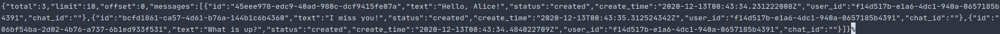
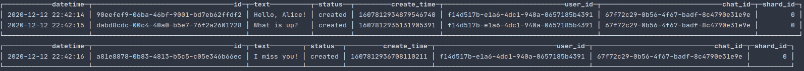
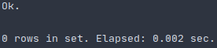
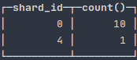
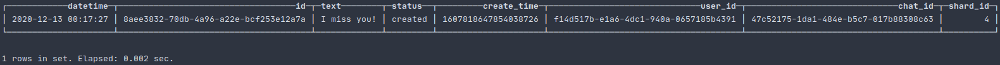
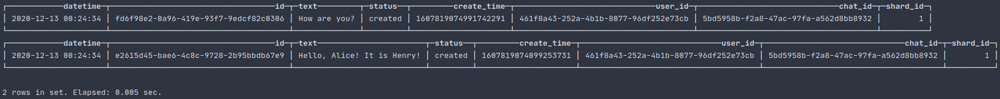
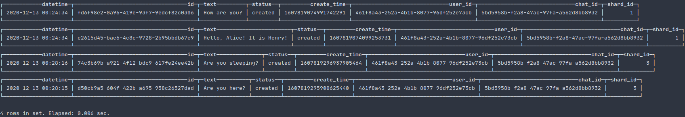

# Отчет о домашнем задании №4. Шардирование 
<p align="center">

</p>

## Содержание
1. [ Задание ](#task)
    - [ Цель ](#task-goal)
    - [ Приобретенные навыки ](#task-skills)
    - [ Постановка задачи ](#task-statement)
2. [ Сведения ](#information)
    - [ Используемые инструменты ](#information-tools)
    - [ Характеристики железа ](#information-computer)
3. [ Ход работы ](#work)
    - [ Предложенный вариант решения ](#work-solution)
        - [ "Эффект *Lady Gaga*" с последующим переводом на другую node'у ](#work-solution-lady-gaga)
        - [ Процедура решардинга ](#work-solution-resharding)
        - [ Оценка предложенного варианта решения ](#work-solution-estimate)
    - [ Выполнение ](#work-execute)
4. [ Итоги ](#results)

<a name="task"></a>
## Задание
Масштабируемая подсистема диалогов.

<a name="task-goal"></a>
### Цель
Реализовать масштабируемую подсистему диалогов, применив при этом стратегию масштабирование БД, как шардирование.

<a name="task-skills"></a>
### Приобретенные навыки
В результате выполненного домашнего задания необходимо приобрести следующие навыки:
- декомпозиции предметной области;
- построения элементарной архитектуры проекта;
- применения механизма шардирования.

<a name="task-statement"></a>
### Постановка задачи
Необходимо написать систему диалогов между пользователями. Обеспечить горизонтальное масштабирование хранилищ на запись
с помощью стратегии шардирования. Предусмотреть:
- возможность процедуры решардинга;
- "эффект *Lady Gaga*" (один пользователь пишет сильно больше среднего);
- наиболее эффективную схему.

<a name="information"></a>
## Сведения
<a name="information-tools"></a>
### Используемые инструменты
Для выполнения дз понадобятся следующие инструменты: 
- [docker](https://docs.docker.com/get-docker/) (>= version 19.03.8) & [docker compose](https://docs.docker.com/compose/install/) (>= version 1.25.5);
- [jq](https://stedolan.github.io/jq/download/) (>= version 1.5)

<a name="information-computer"></a>
### Характеристики железа
Домашнее задание выполнялось на железе со следующими характеристиками:
- CPU - AMD Ryzen 9: 12 ядер 24 потока;
- RAM - 2xHyperX Fury Black: DDR4 DIMM 3000MHz 8GB;
- SSD - Intel® SSD 540s Series: 480GB, 2.5in SATA 6Gb/s, 16nm, TLC

<a name="work"></a>
## Ход работы

<a name="work-solution"></a>
### Предложенный вариант решения
Для решения поставленных задач необходимо очертить им какие-то рамки, так как каждая задача может быть решена по-своему, 
исходя из требований, и представляет собой отдельную независимую проблему. Для того, чтобы не увлечься реализацией
хитрых алгоритмов балансировки и хитрых алгоритмов выбора ключа шардирования, основываясь на эффекте *Lady Gaga*, 
предлагаю правила, которые представлены ниже. Так же оговоримся, что шардировать будем таблицу **Сообщения**, 
основываясь на ID пользователя, который отправляет сообщения.

<a name="work-solution-lady-gaga"></a>
#### "Эффект *Lady Gaga*" с последующим переводом на другую node'у
1. Для того, чтобы знать, какой из пользователей обладает эффектом *Lady Gaga*, необходимо задать определенную метрику,
в данном случае частоту (количество отправленных пользователем сообщений в минуту), по которой мы будем определять: 
нужно ли пользователя переводить на специальный шард для самых "активных" или нет. Пусть это величина будет равна **Q**.
2. По умолчанию id-шарда **Shard.ID** будет определяться довольно просто для каждого из пользователей, которые шлют
сообщения. От ID пользователя (в нашем случае это uuid) берется байтовое представление и переводится в целое значение.
Затем берется остаток от деления на количество доступных шардов **N**. В зависимости от полученного остатка от деления
при помощи cluster-а ClickHouse через таблицу, движок которой Distributed, осуществляется проксирование запроса на 
вставку в нужный шард.
3. Но перед тем, как отдать на откуп дальнейших ройтинг запроса ClickHouse'у, необходимо каждый раз обновлять счетчик
сообщений, которые были отосланы пользователем за промежуток времени **T**(в нашем случае это минута) для дальнейшего
расчета величины **Q**.
4. Если на очередной итерации обновления счетчика, мы понимаем, что пользователь обладает эффектом *Laddy Gaga*, то
записываем в кеш (Redis) этого пользователя (чтоб при очередной отправке сообщений они проксировались на шард для
пользователей с эффектом *Lady Gaga*).

В виде приближенной схемы алгоритма, это будет выглядеть так:</br>
<p align="center">
    
</p>

Т.е. в самом начале мы через кеш проверяем, пользователь относится к группе *Lady Gaga*? Если да, то сразу отправляем
сообщения на shard, предназначенный для "самых активных". Если нет, то вычисляем активность пользователя (количество 
отосланных сообщений в минуту). Если же активность достигла оговоренного предела **Q** то заносим пользователя в список
пользователей, принадлежащих группе *Lady Gaga* (сохраняем его в кеш), перестаем вести расчет его активности и 
отправляем сообщения на шард для "самых активных". Если же активность не достигла предела, то вычисляем id-шарда 
вышеупомянутым способом и отправляем на вычисленный id-шарда сообщения.  

<a name="work-solution-resharding"></a>
#### Процедура решардинга
Теперь, что касается самого решардинга. Важным требованием является работа системы без даунтайма, даже в случае 
решардинга. ClickHouse по-настоящему прекрасный инструмент, который и решает проблему решардинга. Решить ее можно 
многими способами (назначение весов для каждого из шарада и тд), но мы обойдемся простым путем. Мы просто добавим в
распоряжение нашей системе большего количества шардов, для того, чтобы вычисление id-шарада имело больший диапазон. 

<a name="work-solution-estimate"></a>
#### Оценка предложенного варианта решения
Как видно из описания выше есть определенные ограничения и недостатки данного подхода:
  - нельзя пользователя вернуть из шарда, предназначенного для **Lady Gaga**;
  - функция определения ключа шардирования очень примитивна;
  
Подчеркну, что данный алгоритм не оптимален и не универсален в общем виде, однако для решения конкретно нашей задачи -
вполне может быть приемлемым.

<a name="work-execute"></a>
### Выполнение
Для того, чтобы осуществить вышеописанную задумку нам понадобится следующее:
  - собрать cluster Clickhouse, который будет состоять из одной cluster node'ы и пяти node для шардирования;
  - экземпляр кеша(**Redis**-а) для того, чтобы персистентно отслеживать эффект *Lady Gaga'и* у пользователей;

Поднимаем инфраструктуру, состоящую из:
- одного экземпляра MySQL;
- шести экземпляров ClickHouse (один - cluster, остальные - shard'ы);
- одного экземпляра Redis;
- одного экземпляра backend'а
```shell script
make init
```

Для того, чтобы накатить миграции на:
- MySQL
- ClickHouse cluster node'у
- ClickHouse shard nods'ы

выполним команду:
```shell script
make migrate
```

Для демонстрации работы техники шардирования создадим трех пользователей в системе:
 - Боб
 - Алиса
 - Генри
```shell script
curl -X POST -H "Content-Type: application/json" \
    -d '{"email": "bob@email.com", "password": "1234567890", "name": "Bob", "surname": "Tallor", "birthday": "1994-04-10T20:21:25+00:00", "sex": "male", "city": "New Yourk", "interests": "programming"}' \
    http://localhost:9999/auth/sign-up
curl -X POST -H "Content-Type: application/json" \
    -d '{"email": "alice@email.com", "password": "1234567890", "name": "Alice", "surname": "Swift", "birthday": "1995-10-10T20:21:25+00:00", "sex": "female", "city": "California", "interests": "running"}' \
    http://localhost:9999/auth/sign-up
curl -X POST -H "Content-Type: application/json" \
    -d '{"email": "henry@email.com", "password": "1234567890", "name": "Henry", "surname": "Cavill", "birthday": "1993-08-19T20:21:25+00:00", "sex": "male", "city": "Washington", "interests": "sport"}' \
    http://localhost:9999/auth/sign-up
```

Так как uuid-ы создаются random'ным способом на стороне системы, то для однообразного поведения при вычислении ключа 
шардирования в целях демонстрации, зайдем в БД MySQL и обновим UUID-ы Боба, Алисы и Генри. Для этого переходим в 
sql-оболочку docker-container MySQL командой:
```shell script
docker exec -it mysql-storage mysql -uroot -ppassword social-network
```

Теперь зададим пользователям следующие uuid-ы:
```mysql based
update user set id = 'f14d517b-e1a6-4dc1-940a-0657185b4391' where email = 'bob@email.com';
update user set id = 'e1f46383-0a1e-49db-bf79-f0eceab6427c' where email = 'alice@email.com';
update user set id = '461f8a43-252a-4b1b-8077-96df252e73cb' where email = 'henry@email.com';
```
и выйдем из docker-container'а:
```mysql based
exit
```

Забегая вперед, скажу, что, например, uuid Генри был так подобран, что если в нашем распоряжении будет лишь 2 shard'а,
то вычисленный id-shard'а на отправку сообщения будет равен 1, но если же в нашем распоряжении будет целых 4 shard'а, то
id уже станет 3. В этом мы убедимся позже.

А пока получим access token'ы от системы для наших пользователей и запишем их в переменные окружения:
```shell script
export BOB_ACCESS_TOKEN=$(curl -X POST -H "Content-Type: application/json" \
    -d '{"email": "bob@email.com", "password": "1234567890"}' \
    http://localhost:9999/auth/sign-in | jq -r '.access_token')
export ALICE_ACCESS_TOKEN=$(curl -X POST -H "Content-Type: application/json" \
    -d '{"email": "alice@email.com", "password": "1234567890"}' \
    http://localhost:9999/auth/sign-in | jq -r '.access_token')
export HENRY_ACCESS_TOKEN=$(curl -X POST -H "Content-Type: application/json" \
    -d '{"email": "henry@email.com", "password": "1234567890"}' \
    http://localhost:9999/auth/sign-in | jq -r '.access_token')
```

Проверим наличие access token-ов:
```shell script
echo $BOB_ACCESS_TOKEN
echo $ALICE_ACCESS_TOKEN
echo $HENRY_ACCESS_TOKEN
```

Теперь давайте немного початимся :). Для того, чтобы от лица Боба создать чат с Алисой, необходимо получить ее ID, так
как он понадобится для указания собеседника. Воспользуемся URL-ом на получения ID пользователя, зная его email:
```shell script
export ALICE_ID=$(curl -X GET -H "Content-Type: application/json" -H "Authorization: ${BOB_ACCESS_TOKEN}" \
    http://localhost:9999/auth/user?email=alice@email.com | jq -r '.user_id')
```

Проверим, что запрос успешно выполнился, применив команду:
```shell script
echo $ALICE_ID
```

Создадим чат от лица Боба с Алисой:
```shell script
export CHAT_ID=$(curl -X POST -H "Content-Type: application/json" -H "Authorization: ${BOB_ACCESS_TOKEN}" \
    -d '{"companion_id": "'"$ALICE_ID"'"}' \
    http://localhost:9999/messenger/chat | jq -r '.chat_id')
```

Проверим, что в переменной окружения находится UUID созданного чата:
```shell script
echo $CHAT_ID
```

И отправим Алисе несколько сообщений:
```shell script
curl -X POST -H "Content-Type: application/json" -H "Authorization: ${BOB_ACCESS_TOKEN}" \
    -d '{
         "chat_id": "'"$CHAT_ID"'",
         "messages": [
          {
            "text": "Hello, Alice!",
            "status": "created"
          }
          ]
        }' \
    http://localhost:9999/messenger/messages

curl -X POST -H "Content-Type: application/json" -H "Authorization: ${BOB_ACCESS_TOKEN}" \
    -d '{
         "chat_id": "'"$CHAT_ID"'",
         "messages": [
          {
              "text": "What is up?",
              "status": "created"
          }
          ]
        }' \
    http://localhost:9999/messenger/messages

curl -X POST -H "Content-Type: application/json" -H "Authorization: ${BOB_ACCESS_TOKEN}" \
    -d '{
         "chat_id": "'"$CHAT_ID"'",
         "messages": [
          {
               "text": "I miss you!",
               "status": "created"
          }
          ]
        }' \
    http://localhost:9999/messenger/messages
```

Получим со стороны Алисы, зная CHAT_ID, сообщения, которые ей отослал Боб:
```shell script
curl -X GET -H "Content-Type: application/json" -H "Authorization: ${ALICE_ACCESS_TOKEN}" \
    http://localhost:9999/messenger/messages?chat_id=$CHAT_ID
```

Если все прошло успешно, должны увидеть нечто похожее: </br>
<p align="center">
    
</p>

TODO тут какой-то подзаголовок нужен

Шардирование в ClickHouse, как уже было сказано ранее, осуществляется через Distributed таблицу, подробнее [тут](https://clickhouse.tech/docs/ru/engines/table-engines/special/distributed/).
При создании таблицы с таким движком третьим параметром идет способ, по которому ClickHouse определяет, в какой из 
shard'ов осуществлять операцию вставки. В рамках этой работы, для большей гибкости, мы взяли на себя обязательство явно
указывать номер shard'а, в который необходимо записать, но мы так же могли использовать какую либо функцию, например 
**rand()**.

Что касается чтения, ClickHouse сам собирает по всем шардам нужным вам данные, не указывая явно номер шарда, где 
необходимо искать. Ну не красота ли?

Давайте убедимся в том, так ли это?

Для этого для начала перейдем в оболочку ClickHouse cluster node'ы
```shell script
docker exec -it ch-cluster clickhouse-client --user default --password password
```
и сделаем select по сообщениям:
```sql
select shard_id, count(*) from message group by shard_id;
```
<p align="center">
    
</p>

Видим, что вычисление id-shard'а было равно 0 и все сообщения перешли на shard с индексом 0. Напомню, что изначально нам
доступно лишь 2 shard'овые node'ы.

Выйдем из docker-container'а командой:
```mysql based
exit
```

Давайте перейдем на 0 shard и проверим, что действительно сообщения хранятся именно на нем. Для этого перейдем в 
оболочку ClickHouse нулевого shard'а
```shell script
docker exec -it ch-shard-0 clickhouse-client --user default --password password
```
и запросим все сообщения:
```sql
select * from message;
```
<p align="center">
    
</p>

Как видим, сообщения находятся именно тут.

exit

docker exec -it ch-shard-1 clickhouse-client --user default --password password

Если перейти на первую node'e, то при запросе сообщений увидим следующее: </br>
<p align="center">
    
</p>

exit


TODO: заголовок
Изначально нам по конфигурации дано 3 shard'овые node'ы, одна из которых определена для пользователей, которые будут
обладать эффектом *Laddy Gaga*. Её id так же сконфигурирован и равен 4. Максимальное допустимое количество сообщений
в минуту, при котором мы не считаем пользователя *Lady Gaga*'ой равно 10. Сделано оно принципиально таким малым, чтоб
показать работоспособность:)

Теперь наделим Боба эффектом *Lady Gaga* и превысим порог в 10 сообщений в минуту. Для этого отправим Алисе еще
8 сообщений. Для этого 8 раз подряд отправим сообщение Алисе такого вида:
```shell script
curl -X POST -H "Content-Type: application/json" -H "Authorization: ${BOB_ACCESS_TOKEN}" \
    -d '{
         "chat_id": "'"$CHAT_ID"'",
         "messages": [
          {
               "text": "I miss you!",
               "status": "created"
          }
          ]
        }' \
    http://localhost:9999/messenger/messages
```
Очевидно, что семь из восьми сообщений еще будут писаться в 0 shard, однако восьмое сообщение, уже попадет в 4 shard, 
предназначенный для пользователей, обладающих свойством *Lady Gaga*. Давайте проверим это:

Для этого вновь перейдем в оболочку ClickHouse cluster node'ы
```shell script
docker exec -it ch-cluster clickhouse-client --user default --password password
```
и сделаем select по сообщениям:
```sql
select shard_id, count(*) from message group by shard_id;
```

И увидим подтверждение вышесказанного </br>
<p align="center">
    
</p>

exit

И теперь последующие сообщения от Боба автоматически будут уже шардироваться на shard c номеров 4.

Перейдем в оболочку ClickHouse четвертого shard'а:
```shell script
docker exec -it ch-shard-0 clickhouse-client --user default --password password
```
и запросим все сообщения:
```sql
select * from message;
```
<p align="center">
    
</p>

Как видим, одно единственное сообщение находятся именно тут.

Выйдем из docker-container'а командой:
```mysql based
exit
```

TODO Решардинг
Теперь представим такую ситуацию, что в какой-то момент времени нам существующих трех shard'ов стало не хватать. И нам
выделили еще 2 shard'а.

Перед тем как оповестить систему об этом (задав новое доступное число shard'ов), создадим чат от Генри c Алисой.
Убедимся, что сообщения, перед тем как мы добавим новое количество shard'ов, записываются на shard с номером 1.
```shell script
export CHAT_ID=$(curl -X POST -H "Content-Type: application/json" -H "Authorization: ${HENRY_ACCESS_TOKEN}" \
    -d '{"companion_id": "'"$ALICE_ID"'"}' \
    http://localhost:9999/messenger/chat | jq -r '.chat_id')
```

И отправим Алисе несколько сообщений:
```shell script
curl -X POST -H "Content-Type: application/json" -H "Authorization: ${HENRY_ACCESS_TOKEN}" \
    -d '{
         "chat_id": "'"$CHAT_ID"'",
         "messages": [
          {
            "text": "Hello, Alice! It is Henry!",
            "status": "created"
          }
          ]
        }' \
    http://localhost:9999/messenger/messages

curl -X POST -H "Content-Type: application/json" -H "Authorization: ${HENRY_ACCESS_TOKEN}" \
    -d '{
         "chat_id": "'"$CHAT_ID"'",
         "messages": [
          {
              "text": "How are you?",
              "status": "created"
          }
          ]
        }' \
    http://localhost:9999/messenger/messages
```

Перейдем в оболочку ClickHouse cluster node'ы
```shell script
docker exec -it ch-cluster clickhouse-client --user default --password password
```
и сделаем select по сообщениям от Генри:
```sql
select * from message where user_id = '461f8a43-252a-4b1b-8077-96df252e73cb';
```

Должны увидеть следующее: </br>
<p align="center">
    
</p>

Выйдем из docker-container'а командой:
```mysql based
exit
```

Поставим в известность систему о том, что появилось еще 2 shard'a командой:
```shell script
curl -X PUT -H "Content-Type: application/json" \
    -d '{
         "count": 4
        }' \
    http://localhost:9999/messenger/shard
```

Теперь отправим еще два сообщения от Генри Алисе
```shell script
curl -X POST -H "Content-Type: application/json" -H "Authorization: ${HENRY_ACCESS_TOKEN}" \
    -d '{
         "chat_id": "'"$CHAT_ID"'",
         "messages": [
          {
            "text": "Are you here?",
            "status": "created"
          }
          ]
        }' \
    http://localhost:9999/messenger/messages

curl -X POST -H "Content-Type: application/json" -H "Authorization: ${HENRY_ACCESS_TOKEN}" \
    -d '{
         "chat_id": "'"$CHAT_ID"'",
         "messages": [
          {
              "text": "Are you sleeping?",
              "status": "created"
          }
          ]
        }' \
    http://localhost:9999/messenger/messages
```

Перейдем в оболочку ClickHouse cluster node'ы
```shell script
docker exec -it ch-cluster clickhouse-client --user default --password password
```
и сделаем select по сообщениям от Генри:
```sql
select * from message where user_id = '461f8a43-252a-4b1b-8077-96df252e73cb';
```

И увидим, что сообщения уже перебежали на новый shard с номером 3: </br>
<p align="center">
    
</p>

Выйдем из docker-container'а командой:
```mysql based
exit
```

<a name="results"></a>
## Итоги
В ходе выполнения домашнего задания был описан:
- процесс сборки и конфигурирования программного комплекса;
- алгоритм выбора ключа шардирования с учетом "эффекта Леди Гаги";
- процесс решардинга без даунтайма