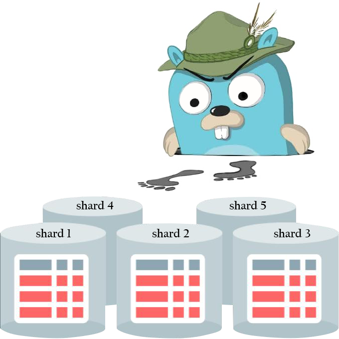
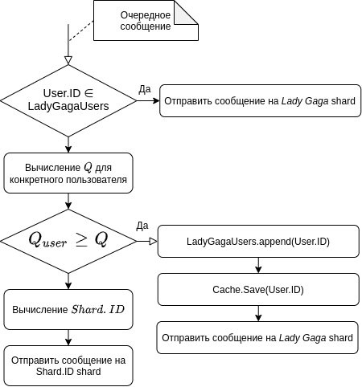

# Отчет о домашнем задании №4. Шардирование 
<p align="center">

</p>

## Содержание
1. [ Задание ](#task)
    - [ Цель ](#task-goal)
    - [ Приобретенные навыки ](#task-skills)
    - [ Постановка задачи ](#task-statement)
2. [ Сведения ](#information)
    - [ Используемые инструменты ](#information-tools)
    - [ Характеристики железа ](#information-computer)
3. [ Ход работы ](#work)
    - [ Предложенный вариант решения ](#work-solution)
        - ["Эффект *Lady Gaga*" с последующим решардингом](#work-solution-lady-gaga)
        - [Процедура решардинга](#work-solution-resharding)
    - [ Выполнение ](#work-execute)
4. [ Итоги ](#results)

<a name="task"></a>
## Задание
Масштабируемая подсистема диалогов.

<a name="task-goal"></a>
### Цель
Реализовать масштабируемую подсистему диалогов, применив при этом стратегию масштабирование БД, как шардирование.

<a name="task-skills"></a>
### Приобретенные навыки
В результате выполненного домашнего задания необходимо приобрести следующие навыки:
- декомпозиции предметной области;
- построения элементарной архитектуры проекта;
- применения механизма шардирования.

<a name="task-statement"></a>
### Постановка задачи
Необходимо написать систему диалогов между пользователями. Обеспечить горизонтальное масштабирование хранилищ на запись
с помощью стратегии шардирования. Предусмотреть:
- возможность процедуры решардинга;
- "эффект *Lady Gaga*" (один пользователь пишет сильно больше среднего);
- наиболее эффективную схему.

<a name="information"></a>
## Сведения
<a name="information-tools"></a>
### Используемые инструменты
Для выполнения дз понадобятся следующие инструменты: 
- [docker](https://docs.docker.com/get-docker/) (>= version 19.03.8) & [docker compose](https://docs.docker.com/compose/install/) (>= version 1.25.5);
- [python](https://www.python.org/downloads/) (>= version 3.6)
- [jq](https://stedolan.github.io/jq/download/) (>= version 1.5)

<a name="information-computer"></a>
### Характеристики железа
Домашнее задание выполнялось на железе со следующими характеристиками:
- CPU - AMD Ryzen 9: 12 ядер 24 потока;
- RAM - 2xHyperX Fury Black: DDR4 DIMM 3000MHz 8GB;
- SSD - Intel® SSD 540s Series: 480GB, 2.5in SATA 6Gb/s, 16nm, TLC

<a name="work"></a>
## Ход работы

<a name="work-solution"></a>
### Предложенный вариант решения
Для решения поставленных задач необходимо очертить им какие-то рамки, так как каждая из них может быть решена по-своему, 
исходя из требований, и представляет собой отдельную независимую проблему. Для того, чтобы не увлечься реализацией
хитрых алгоритмов балансировки и хитрых алгоритмов выбора ключа шардирования, основываясь на эффекте *Lady Gaga*, 
предлагаю правила, которые представлены ниже. Так же оговоримся, что шардировать будем таблицу **Сообщения**, 
основываясь на ID пользователя, который шлет сообщения.

<a name="work-solution-lady-gaga"></a>
#### "Эффект *Lady Gaga*" с последующим решардингом
1. Для того, чтобы знать, какой из пользователей обладает эффектом *Lady Gaga*, необходимо задать определенную метрику,
в данном случае частоту (количество отправленных пользователем сообщений в минуту), по которой мы будем определять, 
нужно ли пользователя переводить на специальный шард для самых "активных" или нет. Пусть это величина будет равна **Q**.
2. По умолчанию номер шарда **ShardN** будет определяться довольно просто для каждого из пользователей, которые шлют сообщения.
От ID пользователя (в нашем случае это uuid) берется байтовое представление и переводится в целое значение. Затем 
берется остаток от деления на количество доступных шардов **N**. В зависимости от полученного остатка от деления при 
помощи правила в ProxySQL осуществляется проксирование запроса на вставку в нужный шард.
3. Но перед тем, как отдать на откуп дальнейших ройтинг запроса ProxySQL-ю, необходимо каждый раз обновлять счетчик
сообщений, которые были отосланы пользователем за промежуток времени **T**(в нашем случае это минута) для дальнейшего
расчета величины **Q**.
4. Если на очередной итерации обновления счетчика, мы понимаем, что пользователь обладает эффектом *Laddy Gaga*, то
записываем в кеш этого пользователя (чтоб при очередной отправке сообщений они проксировались на шард для пользователей
с эффектом *Lady Gaga*). Так же отправляем задачу воркеру для того, чтобы сообщения от этого пользователя, которые были
записаны в шард по умолчанию, были перенесены на шард для пользователей с эффектом *Lady Gaga*.

В виде приближенной схемы алгоритма, это будет выглядеть так:
<p align="center">

</p>

<a name="work-solution-resharding"></a>
#### Процедура решардинга
Теперь, что касается самого решардинга. Важным требованием является работа системы без даунтайма, даже в случае 
решардинга. Для этого необходимо:
1. Написать отдельную программу, которая бы принимала на вход: предыдущее количество шардов **N1**, новое количество 
шардов **N2**, наименование таблицы, подвергающейся решардингу. Затем, следуя пункту 2 из предыдущего подраздела, 
произвести миграцию строк из таблиц уже на новый шард.
2. При этом необходимо изменить (путем создания новых правил) на стороне ProxySQL конфигурацию, в которой приведены
правила проксирования запросов. Т.е. добавить **N2-N1** правил для проксирования на новые и старые шарды.

Как видно из описания выше есть определенные ограничения и недостатки данного подхода:
  - нельзя пользователя вернуть из шарда, предназначенного для **Lady Gaga**;
  - функция определения ключа шардирования очень примитивна и не может полностью равномерно распределить пользователей
  по шарадам (так как у нас ID - uuid, однако если это был бы int, то вполне сгодилась бы)
  
Подчеркну, что данный алгоритм не оптимален и не универсален в общем виде, однако для решения конкретно нашей задачи -
вполне может быть приемлем.

<a name="work-execute"></a>
### Выполнение
Для того, чтобы осуществить вышеописанную задумку нам понадобится следующее:
  - добавить новую колонку **shard_key_id** в таблицу, которую мы хотим шардировать. Данная колонка необходима для того,
  чтоб ProxySQL мог понимать, на какой из доступных ему шародов, согласно заданным ему правилам, необходимо проксировать;
  - экземпляр **ProxySQL** с заданными правилами проксирования;
  - экземпляр кеша(**Redis**-а) для того, чтобы персистентно отслеживать эффект *Lady Gaga'и* у пользователей;
  - шина данных **NATS** для горячей поставке уведомлений утилите, отвечающей за миграцию строк в шард для *Lady Gaga*
  пользователей;
  - утилита отвечающая за решардинг;

Для того, чтобы добавить колонку в таблицу *Message*, была создана следующая миграция:
```mysql based
ALTER TABLE message
    ADD COLUMN shard_key_id INT NOT NULL AFTER chat_id;
```

Поднимаем инфраструктуру, состоящую из:
- трех экземпляров(шардов) MySQL;
- одного экземпляра ProxySQL;
- одного экземпляра Redis;
- одного экземпляра backend'а:
```shell script
make init
```

Для того, чтобы накатить миграции на каждый shard выполним команду:
```shell script
make migrate
```

Создадим двух собеседников Боба и Алису и получим их access token-ы:
```shell script
curl -X POST -H "Content-Type: application/json" \
    -d '{"email": "bob@email.com", "password": "1234567890", "name": "Bob", "surname": "Tallor", "birthday": "1994-04-10T20:21:25+00:00", "sex": "male", "city": "New Yourk", "interests": "programming"}' \
    http://localhost:9999/auth/sign-up
curl -X POST -H "Content-Type: application/json" \
    -d '{"email": "alice@email.com", "password": "1234567890", "name": "Alice", "surname": "Swift", "birthday": "1995-10-10T20:21:25+00:00", "sex": "female", "city": "California", "interests": "running"}' \
    http://localhost:9999/auth/sign-up
export BOB_ACCESS_TOKEN=$(curl -X POST -H "Content-Type: application/json" \
    -d '{"email": "bob@email.com", "password": "1234567890"}' \
    http://localhost:9999/auth/sign-in | jq '.access_token')
export ALICE_ACCESS_TOKEN=$(curl -X POST -H "Content-Type: application/json" \
    -d '{"email": "alice@email.com", "password": "1234567890"}' \
    http://localhost:9999/auth/sign-in | jq '.access_token')
```


Создадим чат от лица Боба с Алисой:
```shell script
export CHAT_ID=$(curl -X POST -H "Content-Type: application/json" -H "Authorization: ${BOB_ACCESS_TOKEN}" \
    -d '{"companion_id": "443cba1f-34cf-11eb-94c7-0242ac1a0005"}' \
    http://localhost:9999/messenger/chat | jq '.chat_id')
```


<a name="results"></a>
## Итоги
В ходе выполнения домашнего задания был описан:
- процесс сборки и конфигурирования программного комплекса;
- алгоритм выбора ключа шардирования с учетом "эффекта Леди Гаги";
- процесс решардинга без даунтайма